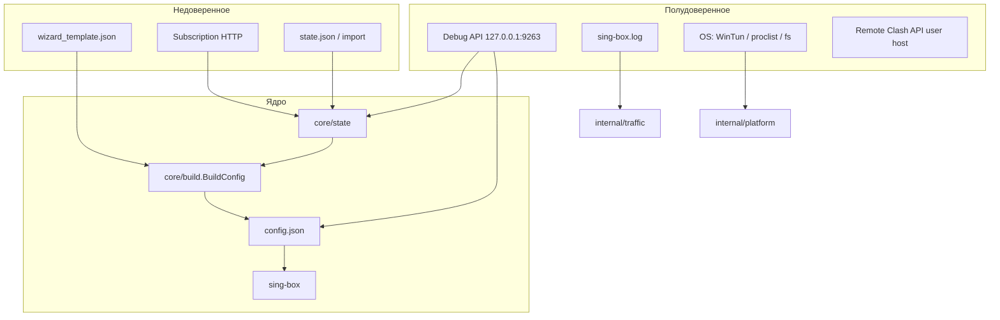
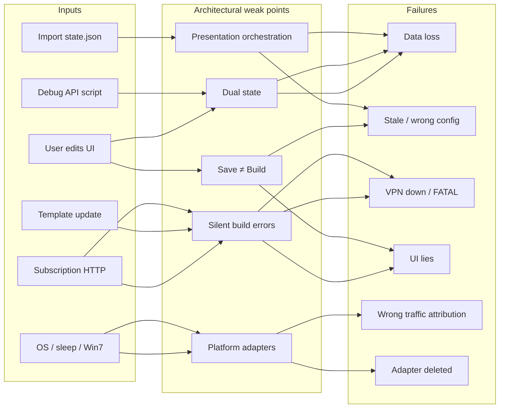

# SPEC 068 — CODE_THREAT_MODEL

**Тип:** Q (Question / architecture research) · **Статус:** N (New)  
**Дата:** 2026-06-07  
**Метод:** git/SPECS audit + code review (25+ файлов) + adversarial verification (25 claims, second agent)

Единый артефакт модели угроз: границы доверия, архитектурные швы, STRIDE-каталог, цепочки отказа, **code findings с file:line**, контекст периода Apr–Jun 2026.

**Scope:** `core/`, `ui/configurator/`, `internal/traffic/`, `internal/platform/`, Debug API, build/state pipeline.

---

## 1. Trust boundaries



| Граница | Данные | Уровень доверия |
|---------|--------|-----------------|
| Subscription fetch | HTTP body → `bin/subscriptions/*.raw` → parser | **Низкий** |
| Template | bundled / pinned ref → substitute / `#if` | **Средний** (policy автора шаблона) |
| state.json | Load/Save, import, Debug API PATCH | **Средний** |
| Debug API | Bearer token, localhost | **Средний** — любой local process |
| Build pipeline | state + template + cache → config | **Высокий** — должен быть детерминирован |
| sing-box runtime | `check -c`, FATAL in log | **Эталон** валидности config |

---

## 2. Карта «откуда → что ломается»



| Input | Weak point | Типичный failure |
|-------|------------|------------------|
| User edits UI | Dual state, Save≠Build | stale config, потеря при edge Save |
| Subscription HTTP | Silent build, parser contract | FATAL config, 0 nodes (Chain 3 — спорно) |
| Template update | Build pipeline, `#if` (067) | schema drift, Win7 reject, breaking `@`-prefix |
| Debug API | Dual state, no Normalize() | data loss без UI |
| OS / Win7 | Platform adapters | adapter deleted, ghost TUN |
| Import state.json | Dual state, v5 load | rules/DNS gone on headless Save |

---

## 3. Архитектурные слабые места

### 3.1 Dual state — два источника правды

In-memory параллельно:

- **Canonical v6:** `State.Connections`, `State.Rules`, `State.DNS`
- **Legacy view:** `State.ParserConfig`, `State.CustomRules`, `State.DNSOptions`

Sync: `core/state/adapter.go`, `ui/configurator/presentation/presenter_state.go`.

| Путь | Риск |
|------|------|
| Save через Configurator | OK — `CreateStateFromModel` эмитит v6 |
| Save через Debug API / headless | Legacy view может устареть |
| Load v5 без `migrateV5ToV6` | v6 пустой, legacy полный → headless Save **теряет rules/DNS** |
| `ParserConfig.Proxies == nil` edge (`adapter.go:28-40`) | Повторный Save идёт другой веткой sync |

Источник регрессий: DNS restore (v0.9.7), SRS identity, preset sync — fixes в v0.9.7–0.9.8.

### 3.2 Split Save / Build / Start

```
Save       → state.json + dirty flags (+ auto-rebuild best-effort)
Rebuild    → config.json (единственный writer: core/rebuild.go)
Start      → RebuildConfigIfDirty best-effort → sing-box
```

| Путь | Риск |
|------|------|
| Save + Close during goroutine | state пишется, UI закрыт; side effects продолжаются |
| Rebuild: sing-box reject | popup есть; `ClearConfigStale()` всё равно (спорно — BUG2) |
| Start: rebuild fail | proceed with old config (`process_service.go:154-156`) |

### 3.3 EventBus + legacy callbacks (SPEC 047)

`StateChanged` / `ConfigBuilt` публикуются. `VpnStateChanged` — **подписан, не публикуется** (`ui/app.go:155`, `core/auto_update.go`, `core/process_service.go`). Legacy `UpdateCoreStatusFunc` / `UpdateConfigStatusFunc` — primary path. Двойной `fyne.Do` в цепочке callbacks.

### 3.4 Presentation = orchestration

`presenter_state.go` / `presenter_sync.go` вызывают `build.MigrateOutbounds*`, `corestate.SyncDNS*`, `build.SyncOutbounds*`. Headless paths минуют presenter. UI path ≠ Debug API path.

Дополнительные UI-риски:

| Файл | Проблема |
|------|----------|
| `presenter_save.go:191-194` | auto-rebuild fail → только `debuglog`, без toast |
| `presenter_save.go:256-288` | success dialog про config.json, Save пишет state.json |
| `presenter_save.go:159-160` | оба dirty flags всегда (intentional до Diff — TD4) |
| `presenter_async.go:60-63` | `GetController()` без nil-check перед fetch в goroutine |
| `configurator.go:635-638` | Close during Save — goroutine не отменяется (BUG3) |

### 3.5 Build pipeline complexity

`core/build/` вырос с ~1.5k LOC до большого resolver graph (053–058–067). Silent degradation:

- `build.go:264-271` — `CleanDanglingOutbounds` fail → warn, route без cleanup
- `build.go:274-278` — `FormatSectionJSON` fail → raw без error
- `resolve_outbounds.go:308-319` — bad patch JSON → silent noop
- `resolve_outbounds.go:217` — warnings от `ExpandPresetOutbounds` отбрасываются

Golden: `core/build/testdata/golden/real-v088/`. SPEC 067: 39+ unit tests `#if` / `@runtime`.

### 3.6 Platform layer

| OS | Код | Риск |
|----|-----|------|
| Win7 | `wintun_cleanup_windows.go:437-496` | aggressive: Wintun + !DN_STARTED, без name-check |
| All | `profiler.go:42-44` | join maps без eviction |
| Windows | `logtail.go` + `inode_windows.go:10` | inode=0, rotation weak; watcher errors ignored |
| All | `profiler.go:109-116` | `Stop()` только bgCancel; maps не очищаются |
| macOS | `proclist_darwin.go` | **опровергнуто BUG5** — comm даёт full path на целевых системах |

### 3.7 Wizard vs Configurator naming split

Go: `ui/configurator/`. UI/types: `WizardModel`, `ShowConfigWizard`, `bin/wizard_states/`, locale `wizard.*`. Onboarding cost, stale docs (`docs/ARCHITECTURE.md` — 12+ ссылок на `ui/wizard/`, `core/state/v5/`).

### 3.8 SPEC / doc hygiene

15+ shipped SPECs не переименованы в `-C-`. Нет `IMPLEMENTATION_REPORT`: 065, 067, 046, 047. `docs/ARCHITECTURE.md` не отражает SPEC 045/052/060 (Save flow, `core/build`, flat `core/state`).

### 3.9 Breaking template surface (067)

Outer `if`/`if_or` требуют `@`-prefix. `vars[].name` = `runtime` зарезервировано (`@runtime.*`). Custom template authors must migrate до upgrade.

---

## 4. Сводная таблица слабых мест

| # | Слабое место | Почему архитектурное | Severity | Зрелость mitigations |
|---|--------------|----------------------|----------|----------------------|
| 1 | Dual state (v6 + legacy) | Transitional 045/060 | **High** | Partial — UI OK |
| 2 | Save / Build / Start trilogy | semantics fuzzy | **High** | Dirty flags + popup |
| 3 | Presentation owns migration | нет `state.Normalize()` | **High** | UI only |
| 4 | EventBus half-migration | SPEC 047 incomplete | Medium | Legacy callbacks |
| 5 | Build silent degradation | resilience vs observability | Medium | Golden tests |
| 6 | Parser `LoadNodesFromSource` | legacy API contract | Medium | **Спорно** BUG4 |
| 7 | Template strict/lenient | author vs runtime | Medium | Validate at load |
| 8 | Profiler unbounded state | MVP in-memory | Medium | Session caps |
| 9 | Platform low test | CI gaps | Medium | Improved 0.9.8 |
| 10 | Debug API control plane | by design | Low–Med | localhost + token |
| 11 | ARCHITECTURE.md stale | onboarding debt | Medium | None |
| 12 | Naming split wizard/configurator | deferred i18n 045 | Medium | None |
| 13 | SPEC folder hygiene | shipped but `-N-` | Low | None |
| 14 | Template 067 breaking | `@` migration | Low–Med | SPEC 046 invalidation |

---

## 5. Каталог угроз (STRIDE-adapted)

### 5.1 Integrity

| ID | Источник | Путь | Severity |
|----|----------|------|----------|
| I1 | v5/v2–v4 state | `parseV5Legacy` без `migrateV5ToV6` | **HIGH** |
| I2 | Debug API PATCH | `SaveState` без presenter sync | Medium |
| I3 | Outbound patch | `resolve_outbounds.go` bad patch noop | Medium |
| I4 | Template lenient | unresolved `@var` → `""` | Medium |

### 5.2 Availability

| ID | Источник | Путь | Severity |
|----|----------|------|----------|
| A1 | Save during Close | goroutine не отменяется | Low–Med |
| A2 | Profiler maps | no eviction | **Medium** |
| A3 | Auto-ping storm | gated 150 (SPEC 039) | Low, mitigated |
| A4 | LogTailer | watcher ignored, no tests | Medium |
| A5 | Profiler Stop | maps не очищаются, restart impossible | Medium |

### 5.3 Confidentiality

| ID | Источник | Путь |
|----|----------|------|
| C1 | `GET /state/full` | secrets in vars |
| C2 | Verbose / Traffic Profiler | domains, IPs |
| C3 | Subscription URL in logs | token in query |

### 5.4 Correctness

| ID | Источник | Путь | Severity |
|----|----------|------|----------|
| R1 | ClearConfigStale after failed check | stale ≠ valid | Low (спорно BUG2) |
| R2 | Start with stale config | rebuild fail → old | Low |
| R3 | evalIf duplicated | preset_expand / resolve_dns | Low |
| R4 | VpnStateChanged dead | EventBus path мёртв | **Medium** |
| R5 | Dual fyne.Do callbacks | Core tab update chain | Low |

### 5.5 Safety

| ID | Источник | Путь | Severity |
|----|----------|------|----------|
| S1 | Win7 Wintun aggressive | third-party adapter | Medium |
| S2 | Remote Clash API | user endpoint | Low |

---

## 6. Критические цепочки отказа

### Chain 1: «Save успешен, VPN мёртв»

1. User Save → `go RebuildConfigIfDirty()` → build OK  
2. `validateConfigViaSingBox` → **FAIL**  
3. Popup + `ConfigBuilt{OK:false}`  
4. `ClearConfigStale()` → marker off (`core/rebuild.go:216`)  
5. Restart → rebuild no-op → старый/rejected config  
6. Start → FATAL in log  

Root: stale semantics vs validation (BUG2 — спорно intentional).

### Chain 2: «Upgrade без Configurator» — CONFIRMED

1. v5 `state.json`  
2. `parseV5Legacy` → CustomRules/DNSOptions OK, Rules/DNS empty  
3. Headless Save  
4. `marshalDisk` → empty v6; legacy not serialized  
5. **Data loss**  

Workaround: open Configurator once → LoadState → Save. Headless broken (BUG1).

### Chain 3: «Подписка — parser path»

1. Network fail  
2. `LoadNodesFromSource` → log, `return nil` error  
3. 0 nodes / old cache  

**Adversarial:** BUG4 опровергнут для Update-path (`FetchSubscriptionWithMeta`). Релевантно parser-only / preview callsites.

### Chain 4: «Win7 после N restarts»

1. Ghost TUN → aggressive cleanup  
2. Wintun + !DN_STARTED, no name prefix  
3. Чужой stopped adapter removed (S1)

### Chain 5: «Долгая сессия Profiler»

1. Maps grow (`connProcessMap`, `dnsAccum`, `dnsByIP`)  
2. No eviction on close  
3. Memory leak (TD6)

---

## 7. Data flow (код)

**После SPEC 045/052:**

```
Configurator Save  →  state.json + dirty flags + StateChanged
Update/Refresh     →  Fetch → bin/subscriptions/<id>.raw → meta in connections
RebuildConfigIfDirty → buildSnapshotFromRawCache → BuildConfig → atomic config.json + ConfigBuilt
Start              →  RebuildConfigIfDirty (best-effort) → sing-box
```

**Save path (детально):**

| Шаг | Код | Примечание |
|-----|-----|------------|
| Save | `presenter_save.go:115-127` | state.json only |
| Dirty | `presenter_save.go:159-160` | CacheStale + ConfigStale always |
| Rebuild | `presenter_save.go:191-194` | go routine, warn on fail |
| Rebuild | `core/rebuild.go` | sole config writer |
| Validate | `core/rebuild.go:179-216` | sing-box check; ClearConfigStale always |
| Start | `process_service.go:154-156` | rebuild fail → old config OK |

**Dual state in Save:**

- `State.Connections` — canonical  
- `State.ParserConfig` — legacy (`adapter.go`)  
- `presenter_state.go:160-162` — sync outbounds на **оба** slice  
- DNS: `state.DNS` v6 + `DNSOptions` legacy dual write (TD3 — inert/by design per adversarial)

---

## 8. Оценка слоёв (code review)

| Layer | Role | Quality | Risk note |
|-------|------|---------|-----------|
| `core/build/` | BuildConfig pure leaf | **strong** | silent degradation edges |
| `core/state/` | Load v2–v6, atomic save | **mixed** | v5 migration gap (BUG1) |
| `core/template/` | `#if`, `@runtime`, validate | **strong** | lenient path for runtime |
| `core/rebuild.go` | sole config writer | **good** | stale on failed check |
| `core/events/` | MemoryBus | **partial** | VpnStateChanged dead |
| `ui/configurator/presentation/` | Save/Load orchestration | **heavy** | layer concentration |
| `internal/traffic/` | Clash + log join | **functional** | leak, logtail gaps |
| `internal/platform/` | Win7 TUN, proclist | **mixed** | low test on Windows |
| `core/debugapi/` | localhost API | **good** | local malware = full access |

---

## 9. Code findings (file:line)

Полная таблица из code audit + статус adversarial review.

| ID | Sev | Adversarial | Location | Суть |
|----|-----|-------------|----------|------|
| **BUG1** | critical | **confirmed** | `core/state/load.go:312-348`, `migration_v5_to_v6.go`, `save.go:100-102` | `migrateV5ToV6` не в load; headless Save теряет rules/DNS |
| BUG2 | high | **disputed** | `core/rebuild.go:179-216` | ClearConfigStale после failed sing-box check — intentional? |
| BUG3 | high | **disputed** | `configurator.go:635-638`, `presenter_save.go:128-200` | Save goroutine при Close — low impact (dialog) |
| BUG4 | high | **rejected** | `source_loader.go:126-131,311` | Update-path OK; parser-only контракт отдельно |
| BUG5 | high | **rejected** | `proclist_darwin.go:13-23` | macOS comm = full path (empirical) |
| **BUG6** | medium | **confirmed** | `ui/app.go:155`, `process_service.go` | VpnStateChanged subscribe, no Publish |
| **BUG7** | low | **confirmed** | `preset_expand.go:279`, `resolve_dns.go:542` | evalIf duplicated |
| BUG8 | medium | **rejected** | `presenter_state.go:217-219` | nil GetController unreachable |
| **TD6** | medium | **confirmed** | `profiler.go:42-44,109-116` | maps no eviction; Stop incomplete |
| **TD7** | low | **confirmed** | `ui/error_banner.go` | dead code (не `ui/components/`) |
| **TD9** | low | **confirmed** | `config_service.go:169` | stale comment outbounds.cache |
| — | low | open | `build.go:264-278` | silent route/format failures |
| — | medium | open | `logtail.go:62-65,96-98` | watcher errors ignored, no Remove before Add |
| — | medium | open | `fetcher.go:239-240` | GetNetworkErrorMessageFunc nil if IsNetworkError set |
| — | low | intentional | `ui/app.go:254` | `updateClashAPITabState` no-op (SPEC 064 stub) |
| — | low | intentional | `wizard_overlay.go` | overlay disabled by default |
| TD1 | — | doc debt | `docs/ARCHITECTURE.md` | ui/wizard, v5/, Save writes config |
| TD2 | — | **rejected** | presentation layer | layer leak overstated |
| TD3 | — | **rejected** | dual DNS write | inert / by design |
| TD4 | — | **intentional** | both dirty flags | until state.Diff wired |
| TD5 | — | **rejected** | rebuild surfacing | `doRebuildOnly` shows errors |
| TD8 | — | **intentional** | ClashAPI stub | SPEC 064 |

---

## 10. Test gaps

| Area | Gap |
|------|-----|
| `core/state/load.go` v5→v6 | migrate not wired; no headless round-trip integration |
| `internal/traffic/logtail.go` | no `logtail_test`; rotation/truncate untested |
| `internal/platform/wintun` | Windows filter logic — only non-Win noop |
| `source_loader.go` | fetch failure propagation untested |
| `internal/traffic/session.go` | no Append/Aggregate* tests |
| `core/build/` edge combos | golden happy path only |

**Quality baseline (2026-06-07):** `go test ./...` PASS, `go vet` PASS, 100 test files, lint 37→0 (May 25), CI Win test trap fixed (0.9.8).

---

## 11. Мёртвый код и doc drift

| Item | Location |
|------|----------|
| `ErrorBanner` / `NewErrorBanner` | `ui/error_banner.go` — не импортируется (`ShowErrorBanner` в `ui/dialogs.go` — отдельная реализация) |
| Main window overlay | `ui/wizard_overlay.go` — `wizardOverlayEnabled=false` |
| `updateClashAPITabState` | `ui/app.go:254` — только EnableItem |
| Comment outbounds.cache | `core/config_service.go:169` — cache retired in SPEC 052 |
| ARCHITECTURE.md | ui/wizard, core/state/v5, Save→config obsolete |

---

## 12. Что работает (контрмеры in-place)

Снижает ложную тревогу — **happy path закрыт:**

- `core/state/save.go` — atomic write tmp→fsync→rename→dir fsync  
- `core/build/` — pure leaf, golden `real-v088`  
- `core/template/` — strict `@` validation, `#if` pre-pass, 39+ tests  
- `ui/traffic/window.go` — deadlock prevention documented  
- `ui/clash_api_tab.go` — generation counter drop-stale (SPEC 064)  
- `core/auto_update.go` — per-source heartbeat, sleep-aware, 5s cooldown  
- `presenter_sync.go` — WizardWidgetsReady, programmatic flags, stale DNS select guard  
- Debug API — localhost + bearer  
- SPEC 039 — auto-ping cap 150 proxies  
- SPEC 046 — template invalidation on upgrade  

---

## 13. Разрывы защиты

| Разрыв | Проявление |
|--------|------------|
| Normalize gate | Load() не гарантирует v6; headless Save без UI migration |
| Rebuild ↔ validation | marker fresh ≠ sing-box accepted |
| Error surface | fetch/build/rebuild → log only in places |
| EventBus ↔ callbacks | dead subscription path |
| Platform guardrails | Win7 aggressive без name-check; wintun untested |
| Lifecycle | Save goroutine vs window close |
| Debug API trust | any local process with token |

---

## 14. Контекст периода (2026-04-07 — 2026-06-07)

### 14.1 Git activity

| Метрика | Значение |
|---------|----------|
| Коммитов | 319 |
| Файлов | 551 |
| + / − строк | +86 715 / −14 834 |
| Apr / May / Jun | 111 / 215 / 28 |
| feat / fix / docs | 88 / 87 / 68 |
| Authors | Leadaxe 239, Alexander Shulman 75 |

### 14.2 Релизы

| Version | Date | Theme |
|---------|------|-------|
| v0.9.9 | 2026-06-06 | Settings window, remote Clash API, Win7 TUN, unified TUN |
| v0.9.8.1 | 2026-05-27 | SRS filename, rule identity |
| v0.9.8 | 2026-05-26 | sing-box 1.13.12, DNS unified order, CI fixes |
| v0.9.7 | 2026-05-25 | Traffic Profiler, SPEC 058/060, Debug API +15 |
| prerelease | 2026-06-07 | SPEC 067 `#if`, proxy-in auth, NLA hotfixes |

### 14.3 Ключевые пакеты (масштаб изменений)

| Package | Role | ~LOC delta |
|---------|------|------------|
| `core/build` | BuildConfig, presets, DNS/route | ~8k+ |
| `ui/configurator` | rename from wizard, UI | ~15k net |
| `core/template` | `#if`, `@runtime` | ~2.5k |
| `core/state` | v5→v6, collapse | ~2k |
| `internal/platform` | Win7 TUN, NLA | ~718 |
| `internal/traffic` | Profiler | ~560 |
| `core/debugapi` | state/traffic/settings API | ~1.5k |

### 14.4 Архитектурная эволюция

| Date | Milestone |
|------|-----------|
| 2026-04-22 | Dirty-config marker (precursor 045) |
| 2026-04-26 | SPEC 045 + 047: events, state, build, snapshot |
| 2026-04-29 | SPEC 052: `ui/wizard` → `ui/configurator`, v5 state, `.raw` cache |
| 2026-05-03 | SPEC 045 phase 9: auto-rebuild on close |
| 2026-05-24–26 | SPEC 058/059/060: template diff, Traffic Profiler, namespace collapse |
| 2026-05–06 | SPEC 061–067: headers, DNS order, remote Clash, `#if` |

**Главный сдвиг:** Save → state only; config → `RebuildConfigIfDirty` → `core/build.BuildConfig`.

### 14.5 SPECs в периоде

**Closed (-C-) примеры:** 011, 019, 024, 027, 032, 038, 041, 044, 052 (+ ~12 others).

**Shipped, folder still open:**

| ID | Status |
|----|--------|
| 033 | Implemented, -N- |
| 045 | Core shipped; i18n open |
| 053–057 | Shipped / on review |
| 058–062, 064 | Shipped |
| 065 | Implemented, upcoming |
| 067 | Active prerelease |

### 14.6 UX surface (контекст exposure)

Traffic Profiler, remote Clash API, Settings window, custom UA/HWID, DNS drag order, template diff outbounds, Debug API automation, Win7 TUN cleanup, `#if` expressions, 9 parser protocols documented.

---

## 15. Adversarial review (2026-06-07)

### Подтверждено

BUG1, BUG6, TD6, BUG7, TD7, TD9 — см. §9.

### Спорное

BUG2, BUG3, TG4, TD1.

### Опровергнуто

BUG4, BUG5, BUG8, TD2, TD3, TD5, TD4, TD8.

---

## 16. Вердикт

**Архитектурный риск — швы между слоями:**

```
state (dual) ↔ build (silent) ↔ UI (orchestration) ↔ platform (untested edges)
```

Период Apr–Jun 2026 — один из самых продуктивных: 4 minor релиза, decoupling 045, Traffic Profiler, expression engine. Продукт: «desktop platform for routing and traffic analysis».

**Happy path:** atomic writes, golden build, tests pass, Debug API bounded.

**Edge paths:** headless migration (BUG1), validation vs stale (Chain 1), platform cleanup (Chain 4), EventBus (BUG6), profiler leak (TD6), doc/SPEC hygiene (TD1, §3.8).

**Operational gap:** ARCHITECTURE.md и EventBus отстают от кода — следующий цикл изменений дороже без синхронизации.

---

## 17. Связанные SPECs

| SPEC | Связь |
|------|-------|
| 045 | state/config decoupling |
| 047 | EventBus — BUG6 |
| 052 | v5, `.raw` cache, configurator rename |
| 058/060 | outbound diff, namespace |
| 059 | Traffic Profiler — TD6 |
| 061 | subscription headers |
| 062 | DNS unified order |
| 064 | remote Clash API |
| 065 | Win7 TUN — Chain 4 |
| 067 | `#if`, breaking `@` |
