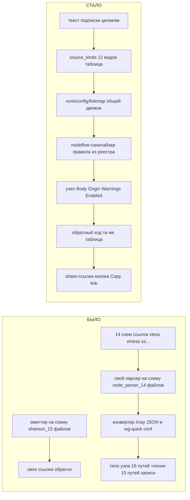
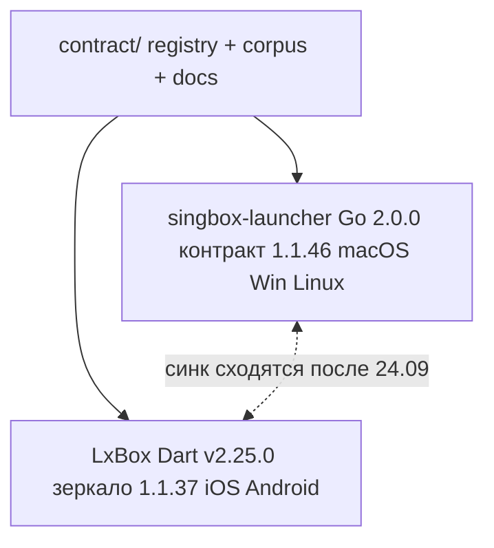
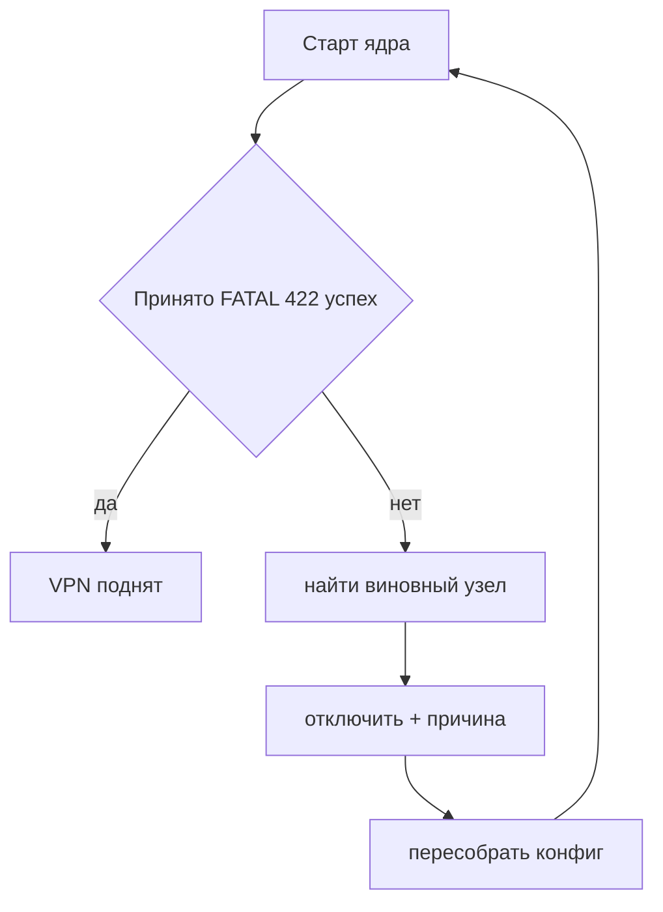

# singbox-launcher: v1.6.3 → 2.0.0 — отчёт кампании

**19.09.2026** · публичный отчёт кампании

Начало единой экосистемы с LxBox: один контракт данных, одинаковое поведение на одних подписках — на десктопе и на телефоне.

## Оглавление

- [1. Цифры релиза](#1-цифры-релиза)
- [2. Было → стало](#2-было--стало-как-читается-ссылка)
- [3. Экосистема](#3-экосистема-общий-контракт-с-lxbox)
- [4. Страховка](#4-страховка-ядро-отвергло-узел-spec-132)
- [5. Лента кампании](#5-лента-кампании-по-волнам)
- [6. Статусы](#6-что-где-стоит)
- [7. Находки ревью](#7-находки-независимых-ревью)
- [8. Кто что делал](#8-кто-что-делал)
- [9. Выпуск](#9-выпуск)

---

## 1. Цифры релиза

Считано командами git/find по репозиторию, ничего не оценивалось на глаз.

| Метрика | Значение |
|---------|----------|
| Коммитов в develop с v1.6.3 | 180 |
| Файлов изменено | 803 |
| Строк добавлено | +100 407 |
| Строк удалено | −12 996 |
| Рукописных Go-файлов парсеров / эмиттеров снесено (`core/config/subscription`) | 32 |
| Версия контракта сейчас / на v1.6.3 (бампов) | 1.1.46 / 1.0.4 — 43 |
| Кейсов в `contract/corpus` | 1 448 |
| Кодов предупреждений в `registry/warnings.json` | 84 |

---

## 2. Было → стало: как читается ссылка

Главная перемена релиза. Раньше на каждую схему ссылки — свой рукописный код. Теперь один движок читает таблицы.

Слева — мир до релиза (16 независимых парсеров, 15 эмиттеров). Справа — единый конвейер по таблицам реестра. Один движок, одна таблица, оба направления.

---

## 3. Экосистема: общий контракт с LxBox

Реестр правил (`contract/`) — общий источник истины для десктопа и телефона.

Разница в версиях контракта — 9 пунктов, аддитивная (LxBox ещё не забрал часть новых правил). Не блокер релиза.

---

## 4. Страховка: «ядро отвергло узел» (SPEC 132)

Ядро проверяет конфиг целиком и на первом непринятом узле отказывается стартовать вовсе. Страховка находит виновника и отключает его сама.

**Где работает:** локально (Classic/демон) · сигнал демона · шаг Final Конфигуратора · удалённые машины.

Причина живёт в `Node.Warnings` кодом `core_rejected` — отдельного поля нет. Смена тела узла снимает вердикт.

---

## 5. Лента кампании по волнам

180 коммитов, сгруппированные по смыслу — не построчный лог.

| Дата | Волна |
|------|-------|
| 16–17.09 | Линукс-сборка, tailscale-статус |
| 18.09 | SPEC 131 — реестр правил, конвейер nodeflow |
| 18.09 | Парсеры схем = мапперы реестра |
| 18.09 | ⚠ Предупреждения узла в UI — error/warning/info |
| 19.09 | SPEC 133 старт — движок linkmap |
| 19.09 | Xray JSON и .conf на движке — рукописные конвертеры удалены |
| 19.09 | Все 14 схем ссылок на движке |
| 19.09 | Обратный ход — эмит по таблице, эмиттеры сняты |
| 19.09 | source_kinds таблицей; кампания SPEC 133 закрыта |
| 19.09 | CI мелочи, аудит мёртвого кода, доки |
| 19.09 | SPEC 132 — страховка Final/демон/remote |
| 19.09 | SPEC 134 — предрелизные ревью |

---

## 6. Что где стоит

| Статус | Пункт |
|--------|-------|
| ✅ готово | Движок linkmap и все 14 схем ссылок |
| ✅ готово | Вход Xray JSON на движке |
| ✅ готово | Вход .conf и ini_dialect данными |
| ✅ готово | Эмит ссылок по таблице, рукописные эмиттеры удалены |
| ✅ готово | source_kinds — виды источника таблицей |
| ✅ готово | Нормы корпуса (1 448 кейсов) |
| ✅ готово | Коды `uri_param_unknown` / `json_field_unknown` / `password_empty` / `xray_extra_entries_dropped` |
| ✅ готово | Порт ss по умолчанию 8388 |
| ✅ готово | splithttp — узнаётся в ссылке |
| ✅ готово | Формат элемента у списков и RawURL-ключ REALITY — чинили оба случая |
| ✅ готово | Тексты кодов en/ru вычитаны |
| ✅ готово | Аудит мёртвого кода |
| ✅ готово | Мелочи CI — codecov v5, пин ubuntu-24.04, страж Win7 |
| ✅ готово | Доки и release notes 2.0.0 |
| ✅ готово | Хвосты страховки — Final-петля, сигнал демона, удалённые машины |
| ✅ готово | Третье независимое ревью (Kimi K3) |
| ✅ готово | CI на финальном HEAD |
| ⏸ отложено | Диалекты sing-box-входа у форков |
| ⏸ отложено | dropped[] + индекс |
| ⏸ отложено | Голый IPv6 в Endpoint .conf |
| ⏸ отложено | Предикат комментария ini данными |
| ⏸ отложено | Сверка оверлеев эмита с LxBox |
| 📌 решение | Версия 2.0.0 как знак единой экосистемы с LxBox |
| 📌 решение | Диагностические отметки — кэш, а не истина, в бэкап не идут |
| 📌 решение | Баннер страховки после перезапуска не восстанавливается |
| 📌 решение | Предупреждение ставится только при реальной потере поведения |
| 📌 решение | tuic с пустым паролем — узел + предупреждение |
| 📌 решение | Порт ss по умолчанию 8388 |
| 📌 решение | Термин «вид источника» / source_kinds.json |
| 📌 решение | Диалекты sing-box-входа — не в этот релиз |

---

## 7. Находки независимых ревью

Три ревью прошли перед релизом: страховка SPEC 132, обратный ход (эмит), разбор источников.

| Находка | Детали |
|---------|--------|
| Предел попыток демона не срабатывал | Счётчик `daemonRejectStartCap` обнулялся на каждом повторе. Исправлено `dfed276c`. |
| Гонка на кэше движка | Data race на `namedValueMaps` — заменено на `sync.Once`, `02691a94`. |
| hysteria2, двойной base64 и пять мелочей | При `port+mport` диапазоны портов терялись; двойная base64-обёртка давала ноль узлов. 7 находок, `eb090912`. |
| Три зеркальных дефекта LxBox не воспроизвелись | Закреплены стражами корпуса. `56ad7444`. |
| Xray-подписки с фрагментацией через freedom | С v1.3.0 подписки с `dialerProxy` → `fragment` теряли серверы. Теперь узел сохраняется с `tls.fragment`. `9e376607`, `48b33781`. |
| Форма обфускации AmneziaWG теряла type узла | Найдено ручной обкаткой владельца. `fe5c0ecb`. |
| Ревью сборки ссылок (эмит) | Дефектов не подтверждено. Copy-link корпус зелёный. |

---

## 8. Кто что делал

| Роль | Зона |
|------|------|
| Основные агенты | Ядро реализации — движок linkmap, конвейер nodeflow, страховка SPEC 132 |
| Вспомогательные исполнители | Документация, тексты предупреждений, чистка легаси, хвосты по спекам |
| Перекрёстные ревью | Независимые ревью реализации разными моделями перед релизом |

---

## 9. Выпуск

- Release notes: `docs/release_notes/2-0-0.md`
- Тег `v2.0.0`
- Сборки всех платформ в CI

---

*Отчёт по репозиторию singbox-launcher (ветка develop) на 19.09.2026. Все цифры — из git/find, без округлений на глаз.*
