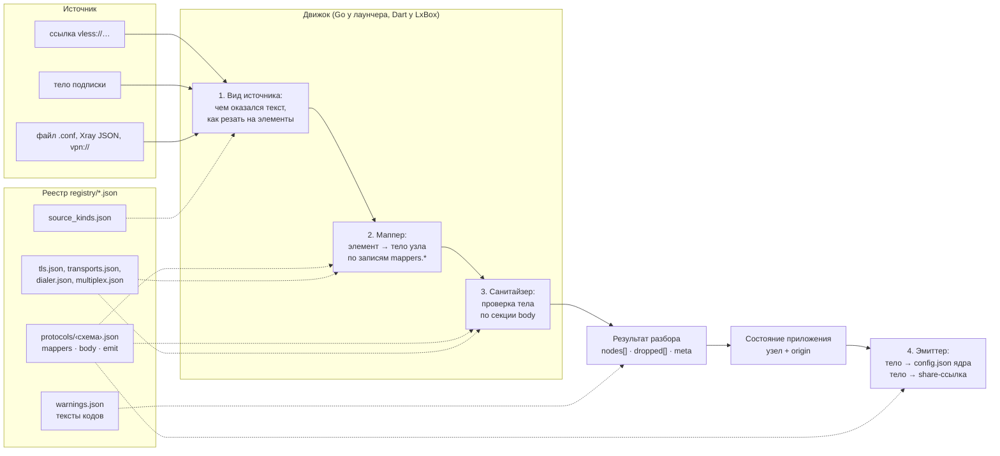

# Архитектура контракта: как из ссылки получается узел

Одна страница для первого знакомства. Что такое реестр, кто его читает, как
текст подписки превращается в узел и в конфиг ядра, и где в этом каталоге
что лежит. Нормы здесь не формулируются: у каждого шага стоит ссылка на
документ, где он описан точно. Слова, выделенные **жирным**, есть в
`GLOSSARY.md`.

## 1. Задача

Два приложения, лаунчер на Go и LxBox на Dart, читают одни и те же ссылки и
подписки и должны получать из них одинаковые узлы. Иначе один сервер на
телефоне и на компьютере будет считаться двумя разными, бэкап не сойдётся,
а каждое новое правило разбора придётся писать дважды и дважды ошибаться.

Решение: правила разбора вынесены из кода в общие таблицы, **реестр**. Код
каждой стороны — это **движок**, который умеет читать таблицу, но не знает
ни одного протокола по имени. Новый протокол или новое правило старого — это
правка таблицы и кейс в **корпусе**, без строчки кода, если движок уже умеет
нужный примитив.

## 2. Схема



Пунктир — «читает таблицу». Сплошная — движение данных. Корпус (`corpus/`)
подключается к стрелке в `R`: у каждого кейса записано, какой результат
разбора обязан получиться, и раннеры обеих сторон сверяют свой результат с
ним побайтно.

## 3. Четыре шага на одном примере

Ссылка из подписки:

```
vless://11111111-1111-1111-1111-111111111111@example-1.com:443?security=tls&sni=example-1.com&flow=xtls-rprx-vision-udp443&encryption=bogus#Frankfurt
```

**Шаг 1. Вид источника** (`registry/source_kinds.json`). Текст подписки
целиком судится предикатами по приоритету: начинается с `vpn://` — контейнер
Amnezia; похож на base64 — распаковать и судить заново; JSON-массив с
`outbounds[]` — конфиг sing-box; иначе список ссылок по строкам. Наша строка
попала в список ссылок, элемент — она сама. Норма: `MAPPER_ENGINE.md` §1–§2.

**Шаг 2. Маппер** (`registry/protocols/vless.json`, секция `mappers.uri`).
По схеме `vless` берётся файл протокола. Его форма `url` читает адрес и
параметры. Каждая **запись** таблицы говорит, откуда взять и куда положить:

| запись | source | maps_to | что ещё |
|---|---|---|---|
| `id` | userinfo | `uuid` | — |
| `flow` | `query.flow` | `flow` | `value_map`: `xtls-rprx-vision-udp443` → `xtls-rprx-vision` |
| `encryption` | `query.encryption` | `encryption` | `value_map`: пусто и `none` → ключа нет |
| `sni` (общий блок `tls.json`) | `query.sni` | `tls.server_name` | — |
| фрагмент | `#Frankfurt` | `label` | метка узла |

Маппер значений не судит: он только переводит диалект ссылки в пути тела.
На выходе сырое тело `{server, server_port, uuid, flow, encryption: "bogus",
tls: {enabled, server_name}}` и метка `Frankfurt`. Норма: `MAPPER_ENGINE.md`
§4–§7.

**Шаг 3. Санитайзер** (та же секция реестра, `body.fields`). Поля проверяются
в порядке `body.order`: `uuid` обязателен; `flow` — enum, негодное значение
снимается с кодом `flow_deprecated`; `encryption` обязан подходить под
`pattern`, иначе `on_invalid: drop_node` с кодом `vless_encryption_invalid`.
Наше `bogus` под шаблон не подходит, и **узел целиком** уходит в `dropped[]`:
такое значение ядро отвергло бы вместе со всем конфигом, а одна битая строка
не должна оставлять без связи остальные. Будь `encryption` в порядке, узел
попал бы в `nodes[]` с телом в канонической форме: ключи отсортированы,
числа числами, без тега и detour. Тексты кодов на двух языках — в
`registry/warnings.json`, приложения своих не держат. Норма:
`PARSING_PRINCIPLES.md` §2, §4, §6; атрибуты полей — `README.md`
§«Атрибуты поля».

**Шаг 4. Эмиттер** (секции `body.order` и `emit`). Когда приложение собирает
`config.json`, тело узла пишется ключами в порядке `body.order`. Когда
пользователь просит share-ссылку, движок идёт по **тем же записям маппера**
в обратную сторону, а секция `emit` задаёт то, что из таблицы не выводится:
порядок параметров (`param_order`), имена для чужих клиентов. Норма:
`MAPPER_ENGINE.md` §9.

## 4. Что лежит рядом с узлом

Разбор даёт тело, но приложению нужно больше:

- **Origin** — чем узел был до разбора, байт в байт (`{kind: uri, raw:
  "vless://…"}`). Хранится в состоянии и в бэкапе; из него узел
  пересобирается, когда реестр поменялся (Regen). У узлов из контейнера
  `vpn://` origin — самодостаточный `.conf` с уже подставленными значениями
  контейнера. Норма: `BACKUP.md` §2.
- **Идентичность** — по какому признаку узел «тот же» при обновлении
  подписки: сырой тег (метка) внутри своего источника, а не содержимое.
  Норма: `IDENTITY.md`. Ссылка на узел из других мест — `{folder_id, tag}`,
  `NODE_LINK.md`.
- **Секции узла** — правила маршрута и DNS, без которых узел не работает
  (Tailscale, WireGuard с подсетями); узел носит их с собой. Норма:
  `NODE_SECTIONS.md`.
- **Предупреждения** (`warnings[]`) — что в узле пришлось починить или
  снять. Производные: пересчитываются при каждом разборе. Исключение —
  вердикт ядра `core_rejected`, `PARSING_PRINCIPLES.md` §9.

## 5. Файл протокола: четыре секции

```
registry/protocols/vless.json
├─ паспорт        scheme, singbox_type, kind, aliases, sources, extension
├─ mappers.uri    как читать ссылку (исполняется движком)      ─┐ пара:
├─ mappers.xray   как читать элемент Xray-конфига               │ разбор
├─ mappers.singbox  как читать outbound sing-box                ─┘
├─ body           какие поля бывают в теле и что делать с негодным (исполняется)
├─ emit           порядок параметров ссылки на выходе (исполняется)
├─ uri, mapper    описание для людей и сверки; не исполняются
└─ refs           где в коде сторон живёт то, что таблицей не выразить
```

Общее для многих схем вынесено: TLS и REALITY — `tls.json`, транспорты
`ws`/`grpc`/`xhttp`/… — `transports.json`, поля dialer'а — `dialer.json`,
мультиплекс — `multiplex.json`. Файл протокола ссылается на них (`ref`).
Подробно — `README.md` §«Структура файлов реестра».

## 6. Корпус и стороны

Корпус — `corpus/uri/<схема>/<кейс>.uri` и `corpus/body/<вид>/<кейс>.body`
плюс `expected.json` рядом. Ожидание пишется **с нормы**, не с того, что
выдал движок: если движок одной стороны даёт другое, красен движок, а не
кейс. Кейс, у которого расхождение сторон признано намеренным, получает
override `<кейс>.expected.lxbox.json`; кейс схемы, которой у одной стороны
нет, получает пометку `meta.extension`. Подробно — `corpus/README.md`.

Изменение реестра или корпуса = новая версия контракта (`VERSION`, строка в
таблице версий `README.md`) и параграф для LxBox в `TASKS_LXBOX.md`. Почему
решили так, а не иначе, — `SPECS/103-F-O-LX_SHARED_CONTRACT/DECISIONS.md`
(номера D-NNN).

## 7. Бэкап и шаблон

Две соседние области с тем же принципом «одна форма на обе стороны»:

- **Бэкап** — файл переноса настроек. Это состояние приложения, записанное
  в общей схеме `schema/backup.schema.json`: запись любой сущности =
  метаданные приложения + `body` (объект sing-box как есть),
  `ONE_NAMESPACE.md`. Импорт сливает по идентичности, непонятное
  отбрасывает с предупреждением. Идеи — `BACKUP_PRINCIPLES.md`, поля и
  процедура — `BACKUP.md`.
- **Шаблон** — JSON с `"@переменная"` и `#if`, из которого сборка делает
  `config.json`. Язык общий, `TEMPLATE_LANG.md`; штатный шаблон лаунчера —
  `bin/wizard_template.json`.

## 8. Куда дальше

По задаче — таблица «Как читать контракт» в `README.md`. По слову —
`GLOSSARY.md`.
