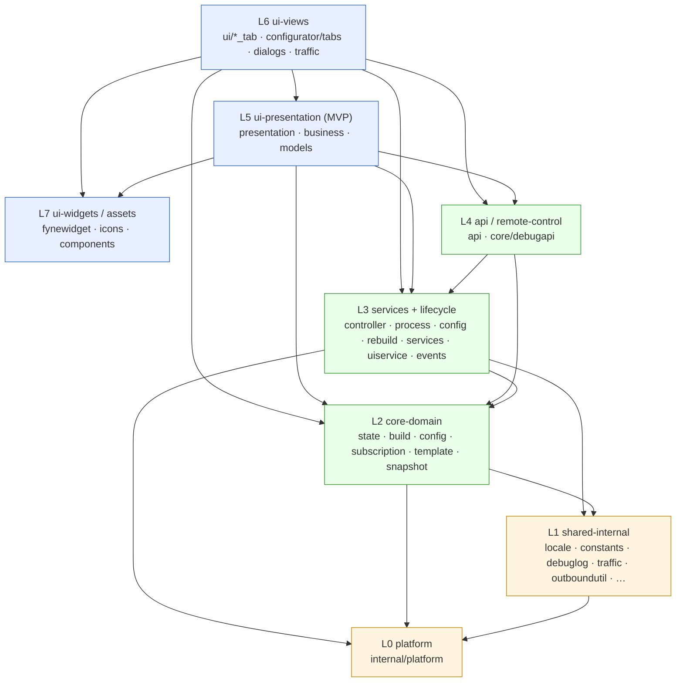

# Architecture — singbox-launcher

> Status: current as of SPEC 070 (architecture refactor & cleanup), branch `develop`.
> This document describes the **layer model, dependency rules, event system, state
> model, data flow, and build pipeline** of the application, plus the Architecture
> Decision Records (ADRs) that govern them.
>
> Companion documents:
> - **[ARCHITECTURE_PACKAGES.md](ARCHITECTURE_PACKAGES.md)** — per-package / per-file inventory (section 8), grouped by layer.
> - **[DATA_FLOW.md](DATA_FLOW.md)** — load / save / build / preset-toggle / edit-dialog flows (storage-time view).
> - **[WIZARD_STATE.md](WIZARD_STATE.md)** — `state.json` v6 schema.
> - **[TEMPLATE_REFERENCE.md](TEMPLATE_REFERENCE.md)** — `wizard_template.json` schema, presets, vars, `#if`.
> - **[ParserConfig.md](ParserConfig.md)** — subscription parser / share-URI reference.
> - **[API.md](API.md)** — Debug HTTP API reference.

---

## 1. Overview

`singbox-launcher` is a cross-platform (Windows / macOS / Linux) desktop GUI that
manages a sing-box VPN core. It is written
in Go with [Fyne](https://fyne.io) for the UI. The launcher downloads and pins a
sing-box binary — specifically the [`sing-box-lx`](https://github.com/Leadaxe/sing-box-lx)
fork (`constants.RequiredCoreVersion = "1.13.13-lx.3"`, built with the `with_xhttp` +
`with_awg` build tags and fetched from the fork's GitHub Releases; the legacy Windows 7
(`windows/386`) path has no fork build and stays on upstream
[SagerNet/sing-box](https://github.com/SagerNet/sing-box) `1.13.12`,
`constants.Win7LegacyVersion`). It fetches and parses proxy subscriptions (VLESS / VMess / Trojan /
Shadowsocks / Hysteria2 / SSH / SOCKS / Naive / WireGuard, plus the Xray JSON-array
format) — including the **XHTTP** transport (`type=xhttp` for VLESS/VMess/Trojan,
parsed, generated into `config.json`, and round-tripped to share URIs) and
**AmneziaWG 2.0** on WireGuard endpoints (obfuscation params `jc`/`jmin`/`jmax`,
`s1`–`s4`, `h1`–`h4`, CPS packets `i1`–`i5`; AWG endpoint MTU auto-clamped to 1280) —
and assembles a working `config.json` from a user-edited **state** plus a
versioned **template**. A configuration **wizard** (the "configurator") lets users
edit subscription sources, global outbounds, routing rules, and DNS, all preview-
rendered against the same resolver pipeline the final build uses.

The runtime side launches and supervises the sing-box process (crash/restart state
machine, power sleep/resume handling, phantom WinTun-adapter cleanup on Windows),
talks to the running core through the Clash API (proxy list, switch, delay tests),
exposes an optional inbound Debug HTTP API for introspection/automation, and runs a
Traffic Profiler. The codebase is organized into strict downward-dependency layers
(L0–L7); SPEC 070 codified those layers, removed dead code, de-duplicated leaf
helpers, and split most large monolith files — while deliberately deferring the
high-risk lifecycle/UI-controller decompositions that need GUI runtime verification.

---

## 2. Layer model (L0 → L7)

The codebase is organized into **eight layers**. The cardinal rule:

> **Imports flow downward only.** A package in layer L*n* may import packages in
> L*n* or any lower layer, but must never import a higher layer. Where a lower
> layer needs to reach "up" (e.g. domain code notifying the UI), it does so through
> an **interface** (`UIUpdater`, `ControllerFacade`, `PresetLite`) or a **callback /
> EventBus**, never a concrete import.

| Layer | Name | Packages | Responsibility |
|-------|------|----------|----------------|
| **L0** | platform | `internal/platform` | OS abstraction behind a unified interface: power sleep/wake, HWID device-info, process enumeration, WinTun ghost-adapter cleanup, canonical filesystem path getters. Depends only on stdlib + `debuglog`/`constants`. No upward imports. |
| **L1** | shared-internal (leaf utilities) | `internal/locale`, `internal/srstag`, `internal/outboundutil`, `internal/urlsafe`, `internal/debuglog`, `internal/constants`, `internal/traffic`, `internal/textnorm`, `internal/urlredact`, `internal/ctxutil`, `internal/process`, `internal/wizardsync` | Self-contained, dependency-free helpers reused across layers: i18n catalog, content-addressed SRS tag hashing, reject/drop outbound→rule mapping (single source of truth shared by core + UI), URL-scheme allowlist, leveled logging, traffic profiler (decoupled, stdlib-only), tag display normalization, URL redaction. |
| **L2** | core-domain (state + build + config + template) | `core/state`, `core/snapshot`, `core/build`, `core/config`, `core/config/subscription`, `core/config/configtypes`, `core/config/parser`, `core/template` | Pure domain: state schema/load/save/migration, the JSON build pipeline and pure resolvers, subscription fetch/parse/encode and outbound generation, template load + preset extraction, snapshot capture. Pure functions where possible; **no Fyne, no `AppController`**. |
| **L3** | services + lifecycle | `core/services`, `core/uiservice`, `core/events`, `core` (`controller.go`, `process_service.go`, `config_service.go`, `rebuild.go`, `auto_update.go`, `main.go`, downloaders) | Stateful service implementations (`FileService`/`APIService`/`StateService`/`SRSDownloader`), the UI-callback container (no Fyne deps), the typed `EventBus`, and app/process lifecycle orchestration. **Owns the EventBus and all DI wiring.** |
| **L4** | api / remote-control | `api`, `core/debugapi` | Outbound Clash API client (`api/`) and inbound Debug HTTP API (`core/debugapi`) that introspects/controls the app through a `ControllerFacade` interface. Both sit above domain but are reachable from services; `debugapi` talks to the controller only via an interface. |
| **L5** | ui-presentation (configurator MVP) | `ui/configurator/presentation`, `ui/configurator/business`, `ui/configurator/models`, `ui/configurator/configurator.go`, `ui/configurator/utils` | MVP layers for the wizard: **presentation** (orchestration + `fyne.Do` dispatch), **business** (pure logic behind the `UIUpdater` interface — never imports Fyne), **models** (pure `WizardModel` + slot/order containers). `business → models → core-domain`; `presentation → business`; **business never imports presentation**. |
| **L6** | ui-views (tabs / dialogs / root) | `ui` (`app.go` + `*_tab.go`), `ui/configurator/tabs`, `ui/configurator/dialogs`, `ui/configurator/outbounds_configurator`, `ui/traffic` | Fyne views: root tab strip, main tabs (Core dashboard, Clash API, diagnostics), configurator tabs/dialogs, outbounds configurator, traffic profiler window. Subscribes to EventBus / UIService callbacks; reads core-domain for rendering. |
| **L7** | ui-widgets / assets | `internal/fynewidget`, `ui/icons`, `ui/components` | Reusable, self-contained Fyne building blocks and assets: hover rows, check-with-content, hover forwarding, tooltips, scroll gutter, embedded SVG icons. Pure Fyne composition (one known exception: `ui/components/click_redirect.go` — see §3). |

### Dependency diagram



ASCII fallback (arrows = allowed import direction, always downward):

```
L7  ui-widgets / assets ─────────────────────────────────┐ (reached up to by L6/L5)
L6  ui-views ────────────────► L5, L4, L3, L2, L7
L5  ui-presentation (MVP) ────► L4, L3, L2, L7
L4  api / remote-control ─────► L3, L2
L3  services + lifecycle ─────► L2, L1, L0          (owns EventBus + DI)
L2  core-domain ──────────────► L1, L0              (pure; no Fyne, no controller)
L1  shared-internal ──────────► L0
L0  platform ─────────────────► (stdlib only)
```

> **Upward escape hatches (by design, not violations):**
> - `core/debugapi` (L4) → `AppController` via the `ControllerFacade` interface.
> - `ui/configurator/business` (L5) → presentation via the `UIUpdater` interface.
> - `core/template`'s `PresetLite` interface lives in `core/state` to break a cycle.
> - L3 → L6/L5 notifications go through the EventBus and UIService callbacks.

---

## 3. Layering rules + known violations

The single rule (imports flow downward; cross-layer-up only via interface/callback)
is mostly upheld — `internal/platform`, `internal/traffic`, and `api` have no upward
imports; `business` never imports Fyne; `debugapi` uses a facade. SPEC 070 codified
the layers specifically so the few real violations become visible and trackable.

| # | Violation | Location | Status | Designed fix |
|---|-----------|----------|--------|--------------|
| V1 | An L7 widget package imports `singbox-launcher/core` to reach `UIService.WizardWindow` for focus elevation. | `ui/components/click_redirect.go` → `core` | **Open** (accepted for the wizard focus flow) | Inject a focus callback `func()` or a small `WizardFocuser` interface from the configurator layer; do not import `core` in `ui/components`. (SPEC 070 P6) |
| V2 | A root main tab (L6) reaches sideways/down into the configurator package and its models (`ValidateStateID`). | `ui/core_dashboard_tab.go` → `ui/configurator` + `ui/configurator/models` | **Open** (intentional "launch wizard from dashboard"; over-broad) | Narrow to a launcher entrypoint + hoist ID validation to `core/state` (state validates its own IDs). (SPEC 070 P6) |
| V3 | `GetController()` fallback constructs a half-wired `AppController` divergent from `NewAppController`, creating two construction paths. | `core/controller.go` `GetController()` | **Open** (deferred; see ADR-070-7) | Delete the fallback; require `NewAppController` in `main()` (already called); use `GetControllerOrPanic()` for nil-safety (already added). |
| V4 | Legacy `State.CustomRules`/`DNSOptions` and canonical `State.Rules`/`DNS` are kept as **parallel sources of truth** inside the domain layer (a layering-of-truth violation, not a package-edge one). | `core/state` load/sync helpers | **Open** (deferred; see ADR-070-2) | Make canonical `Rules`/`DNS` the sole stored truth; derive legacy views on-demand in the UI/business layer. |
| V5 | `StateChanged` + `ConfigBuilt` are published from L3/L5 but have **zero EventBus subscribers**, while `VpnStateChanged` uses **both** EventBus and a legacy UIService callback (`UpdateCoreStatusFunc`) — a dual-wiring inconsistency across the L3/L6 boundary. | `core/services/state_service.go`, `core/rebuild.go`, `presenter_save.go` (publishers); no subscribers | **Open** (deferred; see ADR-070-3, SPEC 047 phase 6) | Wire `ConfigBuilt`/`StateChanged` subscriptions in the dashboard and retire the parallel callbacks. |

> A CI import-graph check that enforces the L*n* → L*≤n* rule is **planned** (ADR-070-1) but not yet implemented.

---

## 4. Event system

### 4.1 The EventBus (`core/events`)

The launcher has a small, typed, **synchronous** event bus introduced in SPEC 047.

- **Typed.** Each event is an `events.Event{Kind EventKind, Payload any}`. The
  payload type is fixed per kind (`StateChangedPayload`, `ConfigBuiltPayload`,
  `VpnStateChangedPayload` in `payloads.go`).
- **Synchronous.** `Publish` invokes every subscriber's `Handler` **in the calling
  goroutine**, in order. Handlers must be cheap and must not block (no network/IO).
- **Panic-isolated.** A panicking handler is recovered so it cannot take down the
  publisher or sibling handlers.
- **`Subscribe` returns a `Cancel` closure** (idempotent) and is thread-safe; the
  handler map is guarded by an `RWMutex`.
- The concrete implementation is `MemoryBus` (`memory_bus.go`); the `AppController`
  owns the single instance (`ac.EventBus`).

```go
// usage
cancel := bus.Subscribe(events.VpnStateChanged, func(ev events.Event) {
    p := ev.Payload.(events.VpnStateChangedPayload)
    // cheap UI refresh dispatch …
})
defer cancel()

bus.Publish(events.Event{Kind: events.ConfigBuilt, Payload: events.ConfigBuiltPayload{OK: true}})
```

> **Stage A cleanup (SPEC 070, done).** The bus surface was trimmed to only the
> kinds that have a real producer or consumer. Removed: the dead `EventKind`s
> `SubscriptionUpdated`, `AutoUpdateStatus`, `PowerResume`, and the
> `ProxyActiveChanged` subscriber (it had no publisher); plus the unused
> `Bus.SubscribeAll` interface method and its `MemoryBus` "all"-subscriber slice.
> `events.go` now defines **exactly three** kinds.

### 4.2 Live event catalog

| Event | Payload | Publisher(s) | Subscriber(s) | Status |
|-------|---------|--------------|---------------|--------|
| **VpnStateChanged** | `VpnStateChangedPayload` | `core/controller.go:474` (on `RunningState.Set` running-bool transition) | `core/auto_update.go:71` (retry failed sources), `ui/app.go:155` (refresh Core-tab icon via `fyne.Do`) | **Wired** — but dual-delivered: also fanned out via the legacy `UpdateCoreStatusFunc` callback. |
| **ConfigBuilt** | `ConfigBuiltPayload{OK bool}` | `core/rebuild.go:188` (OK=false on check failure), `core/rebuild.go:221` (OK=true on successful write+validate) | **none** | **Dead-subscribe** — published, never consumed via the bus. Config-status UI is currently driven by the `UpdateConfigStatusFunc` callback instead. |
| **StateChanged** | `StateChangedPayload` | `core/services/state_service.go:207` (dirty-marker mutations), `ui/configurator/presentation/presenter_save.go:174` (on Configurator Save) | **none** | **Dead-subscribe** — published, never consumed via the bus. |

### 4.3 Legacy UIService callbacks (still in use)

In parallel with the bus, `core/uiservice` holds a set of callback fields the UI
registers handlers on. These pre-date the EventBus and remain the primary mechanism
for several signals:

| Callback | Role | Migration direction |
|----------|------|---------------------|
| `UpdateCoreStatusFunc` | VPN-state UI refresh (Start/Stop/Restart button states) | Parallel to `VpnStateChanged`. Retire in favor of the bus subscription. |
| `UpdateConfigStatusFunc` | Config-status label / Update-button gating / dirty markers | Replace with a `ConfigBuilt` subscription in the Core dashboard. |
| `UpdateParserProgressFunc` / `ShowSubsResultFunc` | Multi-shot subscription progress + final toast | **Keep** — multi-shot progress; could become a typed progress event later (low priority). |
| `RefreshAPIFunc` / `ResetAPIStateFunc` / `AutoPingAfterConnectFunc` | Clash-API refresh/reset/auto-ping wiring | **Keep** — out of scope for SPEC 070 event cleanup. |

> **Migration direction (ADR-070-3).** The target is: `VpnStateChanged`,
> `ConfigBuilt`, and `StateChanged` are delivered **exclusively** through the
> EventBus, and `UpdateCoreStatusFunc`/`UpdateConfigStatusFunc` are removed. That
> consolidation is **SPEC 047 phase 6 / SPEC 070 P5** and is **not yet done** — the
> dual-wiring described above is the current reality. The publish calls for
> `ConfigBuilt`/`StateChanged` are kept (not deleted) precisely so the subscribers
> can be wired without re-plumbing publishers.

---

## 5. State model

### 5.1 Current reality: canonical-v6 + legacy projection (dual-state)

`core/state.State` currently carries **two parallel views** of the same data:

- **Canonical v6 fields:** `Connections` (sources / outbounds / defaults),
  `Rules[]` (kind = preset / inline / srs), and `DNS` (flat `servers[]` / `rules[]`
  with a kind discriminator). This is what `Save` writes to disk (`meta.version = 6`,
  `schema = presets_v1`).
- **Legacy view:** `ParserConfig` (proxies), `CustomRules`, `DNSOptions`,
  `SelectableRuleStates`. These mirror the canonical data for backward-compat UI
  paths that still read the legacy shape.

The two views are kept in sync by **adapters**:

- On **Save**: `syncConnectionsFromLegacy` (`sync_to_connections.go`) copies
  `ParserConfig.Outbounds → Connections.Outbounds` (the "synced" version wins).
- On **Load**: `syncLegacyFromConnections` (`sync_to_legacy.go`) fills `ParserConfig`
  from `Connections`; `legacyCustomRulesFromV6` (in `load_v6.go`) derives
  `CustomRules` from `Rules`.
- For headless `Load → mutate → Save` paths (auto-update, log-level, config_service),
  `deriveV6FromLegacy` (in `load_v5.go` / `load_v2_v3_v4.go`) backfills empty
  canonical `Rules`/`DNS` from the legacy view — the **"BUG1" workaround**.

**The dual-state problem.** Because both views are stored and runtime-backfilled,
headless paths that mutate one view without re-emitting from the configurator can
diverge from the UI. `deriveV6FromLegacy` and `legacyCustomRulesFromV6` exist purely
to paper over having two sources of truth. (This is layering-violation **V4** above.)

### 5.2 Designed target (ADR-070-2) — not yet implemented

`core/state.State` stores **only** canonical `Rules`/`DNS`/`Connections`. Legacy
`CustomRules`/`DNSOptions`/`ParserConfig.Proxies` become **on-demand projections**
computed in the UI/business layer (e.g. a `wizardmodels` helper), not fields on
`State` and not runtime-backfilled. The bidirectional adapter survives **only** as a
read-time migration shim for old (v2–v5) disk files. Once the UI Rules/DNS tabs read
canonical fields directly, `deriveV6FromLegacy`, `legacyCustomRulesFromV6`, and
`State.CustomRules`/`DNSOptions`/`SelectableRuleStates` can be deleted.

> **Accurate status:** dual-state is **still present**. The schema *write path* is
> already single (canonical v6 only, since SPEC 060 removed dual-write); what remains
> is removing the in-memory legacy fields and runtime backfill. Deferred to SPEC 070
> P6 (see §10) because it requires migrating the UI Rules/DNS/source tabs and
> verifying every headless callsite under the GUI runtime.
>
> **Reversion note:** the elimination was actually landed once (commit `43a5f11`,
> canonical v6 as the sole stored truth) and then **reverted** (`a58a176`) after a
> GUI round-trip test surfaced a DNS-save regression. The approach is sound but
> re-landing requires supervised GUI save/load verification of the Rules/DNS/source
> tabs — hence it remains deferred and documented rather than in-flight.

### 5.3 On-disk schema migration

`Load` parses any v2..v6 disk shape and normalizes forward to the canonical
in-memory `State`; `Save` always writes v6. Schema detection routes to per-version
parsers (`load_router.go` → `load_v6.go` / `load_v5.go` / `load_v2_v3_v4.go`), each
followed by a shared `normalizeAfterLoad` (`load_normalize.go`). See
[WIZARD_STATE.md](WIZARD_STATE.md) for the full schema.

---

## 6. Data flow

The launcher has two driving flows: **ingest** (subscription → nodes → state →
config) and **UI edit** (wizard → state → rebuild). Both converge on a single config
writer. (For the storage-time view with diagrams, see [DATA_FLOW.md](DATA_FLOW.md).)

### 6.1 Ingest → state → build → config.json → run

1. **INGEST (subscription → nodes).** UI/auto-update triggers
   `config_service.UpdateConfigFromSubscriptions` → `subscription.LoadNodesFromSource`
   → `fetcher.FetchSubscriptionWithMeta` (HTTP GET with HWID/UA headers, max 10 MB,
   announce-header decode) → `decoder.DecodeSubscriptionContent` (base64 or Xray JSON
   array) → `node_parser.ParseNode` per URI (scheme dispatch → protocol parser →
   transport/TLS build → sing-box outbound JSON) → tag prefix/postfix/mask +
   skip-filter + dedup → `[]ParsedNode`.
2. **CACHE.** Per-source raw body written atomically via `state.WriteRawBody`
   (`.tmp` + `Sync` + `Rename`); outbound JSON produced by
   `config.GenerateOutboundsFromParserConfig` (three passes: `buildOutboundsInfo` →
   `computeOutboundValidity` topological sort → `generateSelectorJSONs`) → `[]string`
   held in `BuildContext.Cache`. `ClearCacheStale` + `MarkConfigStale` set.
3. **STATE WRITE.** `config_service` mutates the `*State` subscription `Meta`, then
   `state.Save` → `syncConnectionsFromLegacy` → `marshalDisk` (v6 layout) → atomic
   write. **`config.json` is NOT written here.**
4. **BUILD (state → sing-box config).** `rebuild.RebuildConfigIfDirty` (the sole
   `config.json` writer; noop fast-path when clean and not forced) →
   `config_service.buildContextFromState` assembles
   `BuildContext{Template, Vars, Cache, DNS, Route, Preset}` → `build.BuildConfig`
   (pure) dispatches per section: `BuildOutboundsSection`,
   `MergeDNSSection → MergePresetsIntoDNS (ResolveDNS)`,
   `MergeRouteSection → MergePresetsIntoRoute (ResolveRoute → ExpandPreset per
   preset-ref)` → concat final JSON → `atomicWriteConfig(ConfigPath, …)`.
5. **RUN.** User Connect → `ProcessService.Start` → `RebuildConfigIfDirty` pre-start
   hook (applies Wizard-Save dirty markers, SPEC 068) → launch sing-box + `Monitor`
   goroutine → `RunningState.Set(true)` → publish `VpnStateChanged` → auto_update
   retry + `ui/app` Core-tab refresh + auto-ping arm.

### 6.2 UI edit → state → rebuild

User edits the `WizardModel` (Sources / GlobalOutbounds / Rules / DNS) in the
configurator tabs → presenter syncs GUI → model (`ReconcileRuleOrder`,
`SyncRulesByOrderToStateRulesV6`, `SyncDNSByOrderToState`) on Save → `presenter_save`
validates → `state.Save` (v6) → publish `StateChanged` + auto-`RebuildConfigIfDirty`
→ success dialog. The next Start re-applies via the pre-start rebuild hook.

### 6.3 The single-writer invariant (ADR-070-4)

> **`config.json` has exactly one writer: `rebuild.RebuildConfigIfDirty`.**
> Verified in code: `RebuildConfigIfDirty` is the only function that calls
> `atomicWriteConfig(ac.FileService.ConfigPath, …)` (`core/rebuild.go:170`).
> `Start()` rebuilds before launching sing-box (pre-start hook); `Update()`
> auto-rebuilds on cache success; `RebuildConfigIfDirty` noop-skips when clean and
> not forced. Neither `Start` nor `Update` writes `config.json` directly. This
> invariant prevents stale-config-on-start regressions and is the anchor of the
> Start/Build/Save state machine.

---

## 7. Build / config pipeline

The build pipeline is a **pure resolver pipeline** (ADR-070-5): impure concerns
(network fetch, state I/O, UI signaling) live in `config_service`/`services`, and the
actual JSON assembly is a pure function over an explicit `BuildContext`.

```
state.json (+ per-source .raw cache)  +  wizard_template.json
            │
            ▼
config_service.buildContextFromState
            │   assembles BuildContext{Template, Vars, Cache, DNS, Route, Preset}
            ▼
build.BuildConfig  (pure)
            │
            ├─► BuildOutboundsSection / BuildEndpointsSection
            │      (consume BuildContext.Cache = GenerateOutboundsFromParserConfig output)
            │
            ├─► MergeDNSSection → MergePresetsIntoDNS → ResolveDNS (pure)
            │      walk state.DNS kind switch (template / preset / user),
            │      attach metadata (Source / Required / Locked / Active / Enabled)
            │
            └─► MergeRouteSection → MergePresetsIntoRoute → ResolveRoute (pure)
                   walk state.Rules kind switch (preset / inline / srs),
                   ExpandPreset per preset-ref (substitute @vars, eval if/if_or,
                   prefix tags, clean dangling rule_set refs)
            │
            ▼
concat final JSON → atomicWriteConfig(config.json)
```

Key properties:

- **`BuildContext` is the seam.** Everything `BuildConfig` needs is captured in the
  context struct; the function performs no I/O. The `Preset.ExecDir` invariant (set
  by the context builder) is required for SRS local-path resolution.
- **One resolved view for UI and build.** `ResolveDNS` / `ResolveRoute` (and the
  per-entry outbound resolver) are the single source of truth consumed by **both**
  the wizard's preview rendering and the final emit — so preview never diverges from
  the written config.
- **`ExpandPreset` is single-sourced.** Both `ResolveRoute` and `ResolveDNS` call it
  once and consume the result; `evalIf` / if-filtering live in one place
  (`preset_expand.go`, unified in SPEC 070 cleanup Stage 3b).
- **Outbound JSON generation** was split out of the 1086-LOC monolith into
  `outbound_validity.go` (the three-pass algorithm), `outbound_jsonbuilder.go`
  (the `JSONBuilder` that appends fields in insertion order, replacing the fragile
  `fmt.Sprintf` + `strings.Join` pattern), and `outbound_filter.go`. The
  `JSONBuilder` is **partially adopted** — the full migration of every protocol
  generator onto it is deferred (see §10).

See [DATA_FLOW.md §3](DATA_FLOW.md) for the build flow with the SPEC 057/058 outbound
`Ref`/`Updates` resolution detail.

---

## 8. Per-package inventory

The full per-package, per-file inventory (one-line responsibility per package, key
files with one-line purposes), grouped by layer L0–L7, lives in a companion file to
keep this document readable:

➡ **[ARCHITECTURE_PACKAGES.md](ARCHITECTURE_PACKAGES.md)**

That file reflects the **current** post-SPEC-070 layout, including the new split
files (per-protocol `node_parser_*` / `shareuri_*`, `clash_*`, `load_v*`,
`sync_to_*`, `outbound_validity`/`outbound_jsonbuilder`, the `reconcilers`/`fillers`/
`validators` DNS split, and the Windows WinTun cleanup split).

---

## 9. Architecture Decision Records (ADRs)

The seven ADRs adopted by SPEC 070. Status legend: **Implemented** · **Partially
implemented** · **Planned (deferred)**.

### ADR-070-1 — Seven-layer package model with strict downward dependencies
- **Decision:** Adopt layers L0 platform → L1 shared-internal → L2 core-domain →
  L3 services+lifecycle → L4 api → L5 ui-presentation (MVP) → L6 ui-views →
  L7 ui-widgets/assets. Imports flow downward only; cross-layer access from below is
  via interfaces (`UIUpdater`, `ControllerFacade`) or callbacks. Add a CI
  import-graph check.
- **Rationale:** The codebase already approximated this; codifying it makes the two
  real package-edge violations (V1, V2) visible and fixable and prevents regressions
  as monoliths are split.
- **Status:** **Partially implemented.** Layers are documented and largely honored;
  the CI import-graph check is **planned**; violations V1/V2 remain open.

### ADR-070-2 — Canonical v6 state is the single source of truth; legacy views are derived projections
- **Decision:** `State` stores only canonical `Rules`/`DNS`/`Connections`. Legacy
  `CustomRules`/`DNSOptions`/`ParserConfig` are computed on-demand in the UI/business
  layer, not stored or runtime-backfilled. The adapter survives solely as a read-time
  migration shim for v2–v5 disk files.
- **Rationale:** Eliminates the BUG1 dual-state problem where headless
  `Load → mutate → Save` paths diverge from the UI.
- **Status:** **Planned (deferred).** Write path is already single-canonical (v6),
  but the in-memory legacy fields and `deriveV6FromLegacy`/`legacyCustomRulesFromV6`
  backfill are still present (SPEC 070 P6).

### ADR-070-3 — Typed EventBus is the single mechanism for cross-layer state-change notifications
- **Decision:** `VpnStateChanged`, `ConfigBuilt`, and `StateChanged` are delivered
  exclusively via the EventBus; legacy `UpdateCoreStatusFunc`/`UpdateConfigStatusFunc`
  callbacks are retired (SPEC 047 phase 6). Events with no producer/consumer are
  deleted rather than kept as placeholders.
- **Rationale:** Dual-wiring the same signal is confusing/error-prone; dead event
  artifacts inflate the bus surface.
- **Status:** **Partially implemented.** Dead kinds + `SubscribeAll` already deleted
  (Stage A). `VpnStateChanged` is on the bus but still dual-wired; `ConfigBuilt`/
  `StateChanged` are published but not yet subscribed. Callback retirement deferred
  (SPEC 070 P5).

### ADR-070-4 — config.json has exactly one writer (`rebuild.RebuildConfigIfDirty`)
- **Decision:** Only `RebuildConfigIfDirty` writes `config.json`. `Start()` rebuilds
  before launching sing-box (pre-start hook, SPEC 068 dirty markers); `Update()`
  auto-rebuilds on cache success; `RebuildConfigIfDirty` noop-skips when clean and
  not forced.
- **Rationale:** Makes the implicit Start/Build/Save invariant explicit; prevents
  stale-config-on-start regressions.
- **Status:** **Implemented.** Verified: `atomicWriteConfig(ConfigPath, …)` is called
  only from `RebuildConfigIfDirty`. (A dedicated integration test asserting the trio
  stays coordinated is still recommended.)

### ADR-070-5 — Pure resolver pipeline (state → BuildContext → BuildConfig)
- **Decision:** `BuildConfig` and the `ResolveDNS`/`ResolveRoute`/`ExpandPreset`
  resolvers remain pure functions over an explicit `BuildContext`; impure concerns
  live in `config_service`/`services`. Outbound JSON generation moves from
  string-concat to a `JSONBuilder` with golden-test coverage.
- **Rationale:** Purity is the codebase's main testability lever and lets the
  outbound generator and build pipeline be decomposed safely.
- **Status:** **Partially implemented.** Resolver pipeline is pure and golden-tested;
  `outbound_jsonbuilder.go` exists and is used, but the full migration of every
  protocol field generator onto the builder is deferred (§10).

### ADR-070-6 — Bidirectional protocol logic is single-sourced via spec builders
- **Decision:** Transport and TLS parsing converge on shared `TransportSpec`/
  `TLSSpec` builders accepting either subscription-URI-query or Xray-JSON input and
  emitting one sing-box shape; UTF-8 and base64 helpers are single utilities;
  per-protocol parse and share-URI-encode logic are co-located one file per protocol.
- **Rationale:** Parser/encoder and URI/Xray paths drift when sing-box's schema
  changes (e.g. a new REALITY field updated in one path only). Single-sourcing the
  spec conversion prevents silent round-trip breakage.
- **Status:** **Partially implemented.** Per-protocol file split (`node_parser_*`,
  `shareuri_*`) and shared `utf8_utils.go` / `encoding_utils.go` are **done**. The
  unified `TransportSpec`/`TLSSpec` builders that merge the URI and Xray paths are
  **planned (deferred)** — the two transport/TLS builders still exist separately.

### ADR-070-7 — Single AppController construction path with focused sub-managers
- **Decision:** `NewAppController` is the only constructor (delete the `GetController`
  fallback; add `GetControllerOrPanic`). The ~113-field controller is decomposed into
  `ProcessLifecycleManager` and `CacheManager`, each owning its own lock with no
  cross-locking; `AppController` becomes a thin orchestrator over services + EventBus
  + callbacks.
- **Rationale:** The half-wired fallback diverges from the real constructor, and four
  independent mutexes create deadlock/race windows under concurrent Update+Start.
- **Status:** **Planned (deferred).** `GetControllerOrPanic` is already added, but the
  `GetController` fallback still exists, and the field/lock extraction is **not done**
  (high concurrency risk; SPEC 070 P5).

---

## 10. Refactor roadmap (SPEC 070)

### 10.1 What was done

SPEC 070 was executed as a sequence of stages, each behavior-preserving and (where
applicable) golden-test guarded.

- **Stage A — event cleanup.** Removed dead `EventKind`s (`SubscriptionUpdated`,
  `AutoUpdateStatus`, `PowerResume`) and payloads; removed the `ProxyActiveChanged`
  subscriber (no publisher); removed `Bus.SubscribeAll` + the `MemoryBus`
  "all"-subscriber slice. `events.go` now has exactly three kinds.
- **Stage B/C — leaf + protocol dedup.** Subscription `utf8_utils.go` and
  `encoding_utils.go` consolidate the duplicated UTF-8 repair and base64-decode
  helpers; `internal/outboundutil` is the single reject/drop → action/method mapper;
  `connections_helpers.go` hosts the hoisted `buildTagSpec`.
- **Stage D — domain monolith splits.**
  - `core/state/load.go` (652 LOC) → `load_router.go` + `load_v6.go` + `load_v5.go`
    + `load_v2_v3_v4.go` + shared `load_normalize.go`.
  - `core/state/adapter.go` (231 LOC) → `sync_to_connections.go` + `sync_to_legacy.go`
    + `connections_helpers.go`.
  - `core/config/subscription/node_parser.go` (744 LOC) → `node_parser_core.go` +
    per-protocol `node_parser_ss/ssh/vmess/wireguard/hysteria2/naive.go`.
  - `core/config/subscription/share_uri_encode.go` (883 LOC) → `share_uri.go`
    dispatcher + `shareuri_*.go` per protocol + `shareuri_helpers.go`.
  - `api/clash.go` (599 LOC) → `clash_config/transport/log/error/proxy/switch/delay.go`.
  - `internal/platform/wintun_cleanup_windows.go` (681 LOC) →
    `wintun_cleanup_windows_device/nla_profiles/nla_sigs/syscall.go`.
- **Stage E — build pipeline decomposition.** `core/config/outbound_generator.go`
  (1086 → 694 LOC) had the three-pass algorithm extracted to `outbound_validity.go`,
  the `JSONBuilder` to `outbound_jsonbuilder.go`, and filtering to `outbound_filter.go`.
- **Stage F — presentation/business dedup + splits.** `business/wizard_dns.go`
  (652 LOC) split into `reconcilers.go` / `fillers.go` / `validators.go` (public API
  now ~232 LOC); `dns_helpers.go` / `template_helpers.go` absorb the duplicated
  template-DNS parsing and `effectiveTemplate` logic; `presenter_state.go` (529 LOC)
  shed helpers into `presenter_state_helpers.go` (now ~325 LOC); UI dashboard/clash
  tabs split into `*_helpers.go` / `*_status.go` / `*_render.go` files.
- **Stage 1–3b correctness/cleanup commits** (see git log `4ddb638`, `df070f9`,
  `b6085a6`, `c2d83c5`): unified `evalIf` / outbound / label helpers, de-duplicated
  `api` + `config` across disjoint zones, removed large dead-code clusters, and
  applied correctness/safety fixes.

### 10.2 What remains (designed-but-deferred)

These targets are **specified by ADRs but intentionally not implemented in SPEC 070**.
The common reason: they touch the live GUI runtime and/or the high-concurrency
lifecycle, so they need interactive runtime verification that the mechanical splits
above did not.

| Target | ADR | Why deferred |
|--------|-----|--------------|
| **Controller field/lock extraction** — split `controller.go` (728 LOC, ~113 fields, 4 mutexes) into `ProcessLifecycleManager` + `CacheManager` + thin `AppController`; delete the `GetController` fallback; unify `Monitor` + `onPrivilegedScriptExited` via one `CrashHandler`. | ADR-070-7 | **High concurrency risk.** Re-partitioning four independent mutexes (`CmdMutex`, `RunningState`, `SubscriptionMu`, parser/version locks) under concurrent Update+Start can introduce deadlocks/races that unit tests won't catch — needs GUI runtime verification of the crash/restart and connect/disconnect paths. |
| **Dual-state elimination** — make canonical `Rules`/`DNS`/`Connections` the sole stored truth; delete `deriveV6FromLegacy`, `legacyCustomRulesFromV6`, `State.CustomRules`/`DNSOptions`/`SelectableRuleStates`; migrate UI Rules/DNS/source tabs to canonical fields. | ADR-070-2 | **Needs GUI runtime verification.** Every headless `Load → mutate → Save` callsite and every UI tab that reads the legacy view must be migrated and re-verified against real state files (v5 upgrades + native v6). |
| **Full callback → event retirement** — wire `ConfigBuilt`/`StateChanged` subscriptions in the Core dashboard; retire `UpdateCoreStatusFunc`/`UpdateConfigStatusFunc`; make `VpnStateChanged` single-mechanism. | ADR-070-3 | **Needs GUI runtime verification.** UI status refresh is timing-sensitive (`fyne.Do` dispatch, dirty-marker styling); swapping the delivery mechanism must be observed live. Publishers are already in place so this is low-code-risk but high-verification-cost. |
| **`JSONBuilder` full adoption** — migrate every protocol field generator in `GenerateNodeJSON` / selector generation onto `JSONBuilder` (insertion-order-safe), behind golden tests. | ADR-070-5 | **Partially done.** The builder exists and is used; finishing the migration is incremental and golden-test-guarded, but not blocking. |
| **Transport/TLS unification** — merge `uriTransportFromQuery` + `xrayTransportFromStreamSettings` into one `TransportSpec` builder, and the three TLS builders into one `TLSSpec` builder. | ADR-070-6 | **Behavior-change risk on round-trip.** Both paths emit subtly different sing-box shapes today; unifying them requires golden round-trip tests across all protocols (subscription-URI ↔ Xray-JSON) to prove no drift. |
| **UI view decomposition** — `clash_api_tab.go` (1266 LOC) → state+handlers; `add_rule_dialog.go` (1146 LOC) → editor-state/tabs/process-picker; `edit_dialog.go` (975 LOC) → edit-state/form-builder/template-resolver. | (supports ADR-070-1) | **Needs GUI runtime verification + ordered after dual-state.** These closures capture large mutable UI state; extracting it safely is best done once dual-state is gone, with live click-through verification. |
| **`config_service.go` decomposition** (1066 LOC) — extract `SubscriptionFetcher` + `ConfigContextBuilder`; split `UpdateConfigFromSubscriptions`. | (supports ADR-070-5) | **High concurrency risk.** Must preserve `SubscriptionMu` boundaries across new service seams; needs the existing `refresh_meta`/`update` tests plus runtime verification of auto-update + manual-update races. |
| **CI import-graph check** enforcing L*n* → L*≤n*. | ADR-070-1 | **Planned tooling**, not yet built; would lock in the layer model and catch V1/V2-style regressions. |

> **Bottom line:** SPEC 070 completed the *mechanical, behavior-preserving* work
> (event/dead-code cleanup, dedup, monolith splits in domain/api/platform/subscription
> and the lower-risk UI/business files) and *documented* the layer model + ADRs. The
> *behavioral* changes (dual-state removal, callback→event swap) and the
> *high-concurrency* lifecycle decompositions (`AppController`, `config_service`) are
> deferred to follow-up phases (P5/P6) that require GUI runtime verification.
