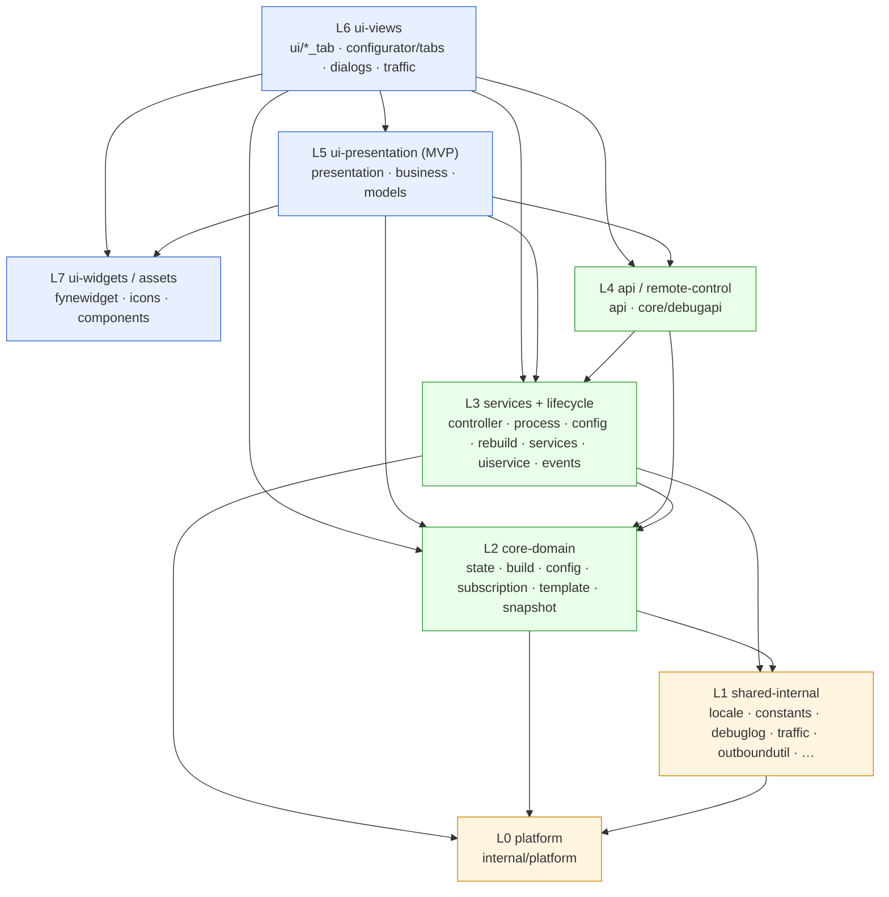

# Architecture — singbox-launcher

**🌐 Language**: English | [Русский](ARCHITECTURE.ru.md)

> Status: layer model and ADRs current as of SPEC 070 (architecture refactor &
> cleanup); §11 covers the core-engine and remote-machine seams added by SPEC
> 096–099. Branch `develop`.
> This document describes the **layer model, dependency rules, event system, state
> model, data flow, and build pipeline** of the application, plus the Architecture
> Decision Records (ADRs) that govern them.
>
> Companion documents:
> - **[ARCHITECTURE_PACKAGES.md](ARCHITECTURE_PACKAGES.md)** — per-package / per-file inventory (section 8), grouped by layer.
> - **[DATA_FLOW.md](DATA_FLOW.md)** — load / save / build / preset-toggle / edit-dialog flows (storage-time view).
> - **[WIZARD_STATE.md](WIZARD_STATE.md)** — `state.json` v6 schema.
> - **[TEMPLATE_REFERENCE.md](TEMPLATE_REFERENCE.md)** — `wizard_template.json` schema, presets, vars, `#if`.
> - **[ParserConfig.md](ParserConfig.md)** — subscription parser / share-URI reference.
> - **[API.md](API.md)** — Debug HTTP API reference.
> - **[DAEMON_AND_REMOTE.md](DAEMON_AND_REMOTE.md)** — daemon core engine, pairing, remote machines (user-facing view of §11).

---

## 1. Overview

`singbox-launcher` is a cross-platform (Windows / macOS / Linux) desktop GUI that
manages a sing-box VPN core. It is written
in Go with [Fyne](https://fyne.io) for the UI. The launcher downloads and pins a
sing-box binary — specifically the [`sing-box-lx`](https://github.com/Leadaxe/sing-box-lx)
fork (`constants.RequiredCoreVersion` — see `internal/constants/constants.go` for the current pin; built with the `with_xhttp` +
`with_awg` build tags and fetched from the fork's GitHub Releases; the fork builds
every platform, including the Windows 7 (`windows/386`) `legacy-windows-7` asset,
so XHTTP/AWG work there too — there is no upstream/legacy split anymore). It fetches
and parses proxy subscriptions (VLESS / VMess / Trojan /
Shadowsocks / Hysteria2 / TUIC / SSH / SOCKS / Naive / WireGuard, plus the Xray
JSON-array format, Amnezia `vpn://` profiles and pasted WG/AWG `[Interface]/[Peer]`
conf text) — including the **XHTTP** transport (`type=xhttp` for VLESS/VMess/Trojan,
parsed, generated into `config.json`, and round-tripped to share URIs) and
**AmneziaWG 2.0** on WireGuard endpoints (obfuscation params `jc`/`jmin`/`jmax`,
`s1`–`s4`, `h1`–`h4` — single values or `lo-hi` randomization ranges, CPS packets
`i1`–`i5`; AWG endpoint MTU auto-clamped to 1280) —
and assembles a working `config.json` from a user-edited **state** plus a
versioned **template**. A configuration **wizard** (the "configurator") lets users
edit subscription sources, global outbounds, routing rules, and DNS, all preview-
rendered against the same resolver pipeline the final build uses.

The runtime side launches and supervises the sing-box process (crash/restart state
machine, power sleep/resume handling, phantom WinTun-adapter cleanup on Windows),
talks to the running core through the Clash API (proxy list, switch, delay tests),
exposes an optional inbound Debug HTTP API for introspection/automation, and runs a
Traffic Profiler.

Since SPEC 096–099 the "running core" is no longer necessarily a child process on
this machine. A `CoreBackend` seam makes two engines interchangeable — *classic*
(spawn `sing-box run`, Clash HTTP) and *daemon* (macOS: the core lives inside the
long-lived `sing-box lxd` service, driven over gRPC + admin REST) — and the same
gRPC client drives **remote machines** (router, VPS, another Mac), each with its
own wizard profile, built config, deploy, traffic profiler and host-telemetry
window. See §11.

The codebase is organized into strict downward-dependency layers
(L0–L7); SPEC 070 codified those layers, removed dead code, de-duplicated leaf
helpers, and split most large monolith files — while deliberately deferring the
high-risk lifecycle/UI-controller decompositions that need GUI runtime verification.

---

## 2. Layer model (L0 → L7)

The codebase is organized into **eight layers**. The cardinal rule:

> **Imports flow downward only.** A package in layer L*n* may import packages in
> L*n* or any lower layer, but must never import a higher layer. Where a lower
> layer needs to reach "up" (e.g. domain code notifying the UI), it does so through
> an **interface** (`UIUpdater`, `ControllerFacade`, `PresetLite`) or a **callback /
> EventBus**, never a concrete import.

| Layer | Name | Packages | Responsibility |
|-------|------|----------|----------------|
| **L0** | platform | `internal/platform`, `internal/paths` | OS abstraction behind a unified interface: power sleep/wake, HWID device-info, process enumeration, WinTun ghost-adapter cleanup, canonical filesystem path getters. `internal/paths` (SPEC 135) resolves the AppDir/DataDir/LogDir layout — a package-leaf below `platform`, which imports it. Depends only on stdlib + `debuglog`/`constants`. No upward imports. |
| **L1** | shared-internal (leaf utilities) | `internal/locale`, `internal/srstag`, `internal/outboundutil`, `internal/urlsafe`, `internal/debuglog`, `internal/constants`, `internal/traffic`, `internal/textnorm`, `internal/urlredact`, `internal/ctxutil`, `internal/process`, `internal/wizardsync`, `internal/lxdclient` | Self-contained, dependency-free helpers reused across layers: i18n catalog, content-addressed SRS tag hashing, reject/drop outbound→rule mapping (single source of truth shared by core + UI), URL-scheme allowlist, leveled logging, traffic profiler (decoupled, stdlib-only), tag display normalization, URL redaction, and the mTLS client for the `sing-box lxd` daemon (pinning, invite parsing, per-machine identity — no app state). |
| **L2** | core-domain (state + build + config + template) | `core/state`, `core/snapshot`, `core/build`, `core/config`, `core/config/subscription`, `core/config/configtypes`, `core/config/parser`, `core/template` | Pure domain: state schema/load/save/migration, the JSON build pipeline and pure resolvers, subscription fetch/parse/encode and outbound generation, template load + preset extraction, snapshot capture. Pure functions where possible; **no Fyne, no `AppController`**. |
| **L3** | services + lifecycle | `core/services`, `core/uiservice`, `core/events`, `core` (`controller.go`, `process_service.go`, `config_service.go`, `rebuild.go`, `auto_update.go`, `backend*.go`, `daemon_manager_darwin.go`, `main.go`, downloaders) | Stateful service implementations (`FileService`/`APIService`/`StateService`/`SRSDownloader`, the remote-machine registry / transport / deploy-resource collector), the UI-callback container (no Fyne deps), the typed `EventBus`, app/process lifecycle orchestration, and the `CoreBackend` engine seam (`LegacyBackend` / `DaemonBackend`). **Owns the EventBus and all DI wiring.** |
| **L4** | api / remote-control | `api`, `core/debugapi` | Outbound Clash API client (`api/`) and inbound Debug HTTP API (`core/debugapi`) that introspects/controls the app through a `ControllerFacade` interface. Both sit above domain but are reachable from services; `debugapi` talks to the controller only via an interface. |
| **L5** | ui-presentation (configurator MVP) | `ui/configurator/presentation`, `ui/configurator/business`, `ui/configurator/models`, `ui/configurator/configurator.go`, `ui/configurator/utils` | MVP layers for the wizard: **presentation** (orchestration + `fyne.Do` dispatch), **business** (pure logic behind the `UIUpdater` interface — never imports Fyne), **models** (pure `WizardModel` + slot/order containers). `business → models → core-domain`; `presentation → business`; **business never imports presentation**. |
| **L6** | ui-views (tabs / dialogs / root) | `ui` (`app.go` + `*_tab.go`), `ui/configurator/tabs`, `ui/configurator/dialogs`, `ui/configurator/outbounds_configurator`, `ui/traffic` | Fyne views: root tab strip, main tabs (Local = proxy list + core dashboard, Remote = proxy list + machine list, then Settings / Diagnostics / Help), configurator tabs/dialogs, outbounds configurator, traffic profiler window, and the per-machine windows (add-machine, connection settings, host telemetry, resources, machine profiler). Subscribes to EventBus / UIService callbacks; reads core-domain for rendering. |
| **L7** | ui-widgets / assets | `internal/fynewidget`, `ui/icons`, `ui/components` | Reusable, self-contained Fyne building blocks and assets: hover rows, check-with-content, hover forwarding, tooltips, scroll gutter, embedded SVG icons. Pure Fyne composition, with no dependency on `core` (the former `click_redirect.go` exception was removed — see §3, V1). |

### Dependency diagram


```mermaid
graph TD
    L7["L7 ui-widgets / assets<br/>fynewidget · icons · components"]
    L6["L6 ui-views<br/>ui/*_tab · configurator/tabs · dialogs · traffic"]
    L5["L5 ui-presentation (MVP)<br/>presentation · business · models"]
    L4["L4 api / remote-control<br/>api · core/debugapi"]
    L3["L3 services + lifecycle<br/>controller · process · config · rebuild · services · uiservice · events"]
    L2["L2 core-domain<br/>state · build · config · subscription · template · snapshot"]
    L1["L1 shared-internal<br/>locale · constants · debuglog · traffic · outboundutil · …"]
    L0["L0 platform<br/>internal/platform"]

    L6 --> L5
    L6 --> L4
    L6 --> L3
    L6 --> L2
    L6 --> L7
    L5 --> L4
    L5 --> L3
    L5 --> L2
    L5 --> L7
    L4 --> L3
    L4 --> L2
    L3 --> L2
    L3 --> L1
    L3 --> L0
    L2 --> L1
    L2 --> L0
    L1 --> L0

    classDef ui fill:#e8f0ff,stroke:#3366cc;
    classDef core fill:#eaffea,stroke:#339933;
    classDef base fill:#fff4e0,stroke:#cc8800;
    class L7,L6,L5 ui;
    class L4,L3,L2 core;
    class L1,L0 base;
```

ASCII fallback (arrows = allowed import direction, always downward):

```
L7  ui-widgets / assets ─────────────────────────────────┐ (reached up to by L6/L5)
L6  ui-views ────────────────► L5, L4, L3, L2, L7
L5  ui-presentation (MVP) ────► L4, L3, L2, L7
L4  api / remote-control ─────► L3, L2
L3  services + lifecycle ─────► L2, L1, L0          (owns EventBus + DI)
L2  core-domain ──────────────► L1, L0              (pure; no Fyne, no controller)
L1  shared-internal ──────────► L0
L0  platform ─────────────────► (stdlib only)
```

> **Upward escape hatches (by design, not violations):**
> - `core/debugapi` (L4) → `AppController` via the `ControllerFacade` interface.
> - `ui/configurator/business` (L5) → presentation via the `UIUpdater` interface.
> - `core/template`'s `PresetLite` interface lives in `core/state` to break a cycle.
> - L3 → L6/L5 notifications go through the EventBus and UIService callbacks.

---

## 3. Layering rules + known violations

The single rule (imports flow downward; cross-layer-up only via interface/callback)
is mostly upheld — `internal/platform`, `internal/traffic`, `internal/lxdclient` and
`api` have no upward imports; `business` never imports Fyne; `debugapi` uses a
facade. SPEC 070 codified the layers specifically so the few real violations become
visible and trackable; the SPEC 094–099 cleanup pass then closed V1 and V3.

| # | Violation | Location | Status | Designed fix |
|---|-----------|----------|--------|--------------|
| V1 | An L7 widget package imports `singbox-launcher/core` to reach `UIService.WizardWindow` for focus elevation. | `ui/components/click_redirect.go` → `core` | **Fixed** (SPEC 094–099 cleanup pass, `ce8048e`) | Done: `ClickRedirect` now takes `*uiservice.UIService` — a leaf package — instead of the whole `*core.AppController`. `ui/components` no longer imports `core` at all, which also cut `ui/traffic` from 20 transitive internal deps to 8, making its documented isolation from `AppController` factual. |
| V2 | A root main tab (L6) reaches sideways/down into the configurator package and its models (`ValidateStateID`). | `ui/core_dashboard_tab.go` → `ui/configurator` + `ui/configurator/models` | **Open** (intentional "launch wizard from dashboard"; over-broad) | Narrow to a launcher entrypoint + hoist ID validation to `core/state` (state validates its own IDs). (SPEC 070 P6) |
| V3 | `GetController()` fallback constructs a half-wired `AppController` divergent from `NewAppController`, creating two construction paths. | `core/controller.go` `GetController()` | **Fixed** (the fallback is gone) | Done: `GetController()` now just returns the singleton (nil before construction), `NewAppController` in `main()` is the only construction path, and `GetControllerOrPanic()` covers callsites that cannot proceed without it. The *field/lock extraction* half of ADR-070-7 remains deferred (§10.2). |
| V4 | Legacy `State.CustomRules`/`DNSOptions` and canonical `State.Rules`/`DNS` are kept as **parallel sources of truth** inside the domain layer (a layering-of-truth violation, not a package-edge one). | `core/state` load/sync helpers | **Open** (deferred; see ADR-070-2) | Make canonical `Rules`/`DNS` the sole stored truth; derive legacy views on-demand in the UI/business layer. |
| V5 | `StateChanged` + `ConfigBuilt` are published from L3/L5 but have **zero EventBus subscribers**, while `VpnStateChanged` uses **both** EventBus and a legacy UIService callback (`UpdateCoreStatusFunc`) — a dual-wiring inconsistency across the L3/L6 boundary. | `core/services/state_service.go`, `core/rebuild.go`, `presenter_save.go` (publishers); no subscribers | **Open** (deferred; see ADR-070-3, SPEC 047 phase 6) | Wire `ConfigBuilt`/`StateChanged` subscriptions in the dashboard and retire the parallel callbacks. |

> A CI import-graph check that enforces the L*n* → L*≤n* rule is **planned** (ADR-070-1) but not yet implemented.

---

## 4. Event system

### 4.1 The EventBus (`core/events`)

The launcher has a small, typed, **synchronous** event bus introduced in SPEC 047.

- **Typed.** Each event is an `events.Event{Kind EventKind, Payload any}`. The
  payload type is fixed per kind (`StateChangedPayload`, `ConfigBuiltPayload`,
  `VpnStateChangedPayload` in `payloads.go`).
- **Synchronous.** `Publish` invokes every subscriber's `Handler` **in the calling
  goroutine**, in order. Handlers must be cheap and must not block (no network/IO).
- **Panic-isolated.** A panicking handler is recovered so it cannot take down the
  publisher or sibling handlers.
- **`Subscribe` returns a `Cancel` closure** (idempotent) and is thread-safe; the
  handler map is guarded by an `RWMutex`.
- The concrete implementation is `MemoryBus` (`memory_bus.go`); the `AppController`
  owns the single instance (`ac.EventBus`).

```go
// usage
cancel := bus.Subscribe(events.VpnStateChanged, func(ev events.Event) {
    p := ev.Payload.(events.VpnStateChangedPayload)
    // cheap UI refresh dispatch …
})
defer cancel()

bus.Publish(events.Event{Kind: events.ConfigBuilt, Payload: events.ConfigBuiltPayload{OK: true}})
```

> **Stage A cleanup (SPEC 070, done).** The bus surface was trimmed to only the
> kinds that have a real producer or consumer. Removed: the dead `EventKind`s
> `SubscriptionUpdated`, `AutoUpdateStatus`, `PowerResume`, and the
> `ProxyActiveChanged` subscriber (it had no publisher); plus the unused
> `Bus.SubscribeAll` interface method and its `MemoryBus` "all"-subscriber slice.
> `events.go` now defines **exactly three** kinds.

### 4.2 Live event catalog

| Event | Payload | Publisher(s) | Subscriber(s) | Status |
|-------|---------|--------------|---------------|--------|
| **VpnStateChanged** | `VpnStateChangedPayload` | `core/controller.go:474` (on `RunningState.Set` running-bool transition) | `core/auto_update.go:71` (retry failed sources), `ui/app.go:155` (refresh Core-tab icon via `fyne.Do`) | **Wired** — but dual-delivered: also fanned out via the legacy `UpdateCoreStatusFunc` callback. |
| **ConfigBuilt** | `ConfigBuiltPayload{OK bool}` | `core/rebuild.go:188` (OK=false on check failure), `core/rebuild.go:221` (OK=true on successful write+validate) | **none** | **Dead-subscribe** — published, never consumed via the bus. Config-status UI is currently driven by the `UpdateConfigStatusFunc` callback instead. |
| **StateChanged** | `StateChangedPayload` | `core/services/state_service.go:207` (dirty-marker mutations), `ui/configurator/presentation/presenter_save.go:174` (on Configurator Save) | **none** | **Dead-subscribe** — published, never consumed via the bus. |

### 4.3 Legacy UIService callbacks (still in use)

In parallel with the bus, `core/uiservice` holds a set of callback fields the UI
registers handlers on. These pre-date the EventBus and remain the primary mechanism
for several signals:

| Callback | Role | Migration direction |
|----------|------|---------------------|
| `UpdateCoreStatusFunc` | VPN-state UI refresh (Start/Stop/Restart button states) | Parallel to `VpnStateChanged`. Retire in favor of the bus subscription. |
| `UpdateConfigStatusFunc` | Config-status label / Update-button gating / dirty markers | Replace with a `ConfigBuilt` subscription in the Core dashboard. |
| `UpdateParserProgressFunc` / `ShowSubsResultFunc` | Multi-shot subscription progress + final toast | **Keep** — multi-shot progress; could become a typed progress event later (low priority). |
| `RefreshAPIFunc` / `ResetAPIStateFunc` / `AutoPingAfterConnectFunc` | Clash-API refresh/reset/auto-ping wiring | **Keep** — out of scope for SPEC 070 event cleanup. |

> **Migration direction (ADR-070-3).** The target is: `VpnStateChanged`,
> `ConfigBuilt`, and `StateChanged` are delivered **exclusively** through the
> EventBus, and `UpdateCoreStatusFunc`/`UpdateConfigStatusFunc` are removed. That
> consolidation is **SPEC 047 phase 6 / SPEC 070 P5** and is **not yet done** — the
> dual-wiring described above is the current reality. The publish calls for
> `ConfigBuilt`/`StateChanged` are kept (not deleted) precisely so the subscribers
> can be wired without re-plumbing publishers.

---

## 5. State model

### 5.1 Current reality: canonical-v6 + legacy projection (dual-state)

`core/state.State` currently carries **two parallel views** of the same data:

- **Canonical v6 fields:** `Connections` (sources / outbounds / defaults),
  `Rules[]` (kind = preset / inline / srs), and `DNS` (flat `servers[]` / `rules[]`
  with a kind discriminator). This is what `Save` writes to disk (`meta.version = 6`,
  `schema = presets_v1`).
- **Legacy view:** `ParserConfig` (proxies), `CustomRules`, `DNSOptions`,
  `SelectableRuleStates`. These mirror the canonical data for backward-compat UI
  paths that still read the legacy shape.

The two views are kept in sync by **adapters**:

- On **Save**: `syncConnectionsFromLegacy` (`sync_to_connections.go`) copies
  `ParserConfig.Outbounds → Connections.Outbounds` (the "synced" version wins).
- On **Load**: `syncLegacyFromConnections` (`sync_to_legacy.go`) fills `ParserConfig`
  from `Connections`; `legacyCustomRulesFromV6` (in `load_v6.go`) derives
  `CustomRules` from `Rules`.
- For headless `Load → mutate → Save` paths (auto-update, log-level, config_service),
  `deriveV6FromLegacy` (in `load_v5.go` / `load_v2_v3_v4.go`) backfills empty
  canonical `Rules`/`DNS` from the legacy view — the **"BUG1" workaround**.

**The dual-state problem.** Because both views are stored and runtime-backfilled,
headless paths that mutate one view without re-emitting from the configurator can
diverge from the UI. `deriveV6FromLegacy` and `legacyCustomRulesFromV6` exist purely
to paper over having two sources of truth. (This is layering-violation **V4** above.)

### 5.2 Designed target (ADR-070-2) — not yet implemented

`core/state.State` stores **only** canonical `Rules`/`DNS`/`Connections`. Legacy
`CustomRules`/`DNSOptions`/`ParserConfig.Proxies` become **on-demand projections**
computed in the UI/business layer (e.g. a `wizardmodels` helper), not fields on
`State` and not runtime-backfilled. The bidirectional adapter survives **only** as a
read-time migration shim for old (v2–v5) disk files. Once the UI Rules/DNS tabs read
canonical fields directly, `deriveV6FromLegacy`, `legacyCustomRulesFromV6`, and
`State.CustomRules`/`DNSOptions`/`SelectableRuleStates` can be deleted.

> **Accurate status:** dual-state is **still present**. The schema *write path* is
> already single (canonical v6 only, since SPEC 060 removed dual-write); what remains
> is removing the in-memory legacy fields and runtime backfill. Deferred to SPEC 070
> P6 (see §10) because it requires migrating the UI Rules/DNS/source tabs and
> verifying every headless callsite under the GUI runtime.
>
> **Reversion note:** the elimination was actually landed once (commit `43a5f11`,
> canonical v6 as the sole stored truth) and then **reverted** (`a58a176`) after a
> GUI round-trip test surfaced a DNS-save regression. The approach is sound but
> re-landing requires supervised GUI save/load verification of the Rules/DNS/source
> tabs — hence it remains deferred and documented rather than in-flight.

### 5.3 On-disk schema migration

`Load` parses any v2..v6 disk shape and normalizes forward to the canonical
in-memory `State`; `Save` always writes v6. Schema detection routes to per-version
parsers (`load_router.go` → `load_v6.go` / `load_v5.go` / `load_v2_v3_v4.go`), each
followed by a shared `normalizeAfterLoad` (`load_normalize.go`). See
[WIZARD_STATE.md](WIZARD_STATE.md) for the full schema.

---

## 6. Data flow

The launcher has two driving flows: **ingest** (subscription → nodes → state →
config) and **UI edit** (wizard → state → rebuild). Both converge on a single config
writer. (For the storage-time view with diagrams, see [DATA_FLOW.md](DATA_FLOW.md).)

### 6.0 Node flow: three stages from text to body (SPEC 131)

Whatever a node arrives as — a share link, a hand-written JSON object, a
subscription body, a WireGuard `.conf`, a backup entry or a form edit — its
**body** is produced by exactly one sequence:

```
text ──▶ 1. mapper ──▶ 2. sanitizer ──▶ 3. emitter ──▶ state.Node{Body, Warnings[]}
         (dialect)     (registry rules)   (table)                    │
                                                                     ▼  build
                                                      core/platform gate ──▶ config.json
```

1. **Mapper** (`core/config/linkmap`, driven by the `contract/registry/**/mappers.*`
   tables) translates a dialect into the canonical sing-box shape:
   `sni`→`tls.server_name`, `?ed=N`→`max_early_data`, Xray
   `streamSettings.*`→`transport.*`. **Which** value goes **where** is declared by
   the registry, not written in Go: there is no scheme or protocol name in the
   engine, because every such name would be a second copy of a rule that already
   exists as data. It decides nothing about *values*; its only refusals are "form
   not recognised" and "syntax unparseable". Architecture —
   `contract/docs/MAPPER_ENGINE.md`.
2. **Sanitizer** (`core/config/nodeflow.Sanitize`) applies the rules of
   `contract/registry/**` — type, enum, format, per-scheme bans, conflicts,
   unknown keys. Anything removed or coerced produces a `{code, path}` warning.
   The code knows no protocol by name; every scheme-specific difference is data.
3. **Emitter** (`core/config/nodeflow.Emit`) walks the registry's field order and
   writes what the sanitizer left. No per-scheme branching and no type asserts —
   the values are already coerced.

`core/config.materializeBody` is the single entry point to that sequence, and
`state.Node.Body` is only ever written from its output.

Two properties fall out of this, and both are load-bearing:

- **A value the core rejects fatally cannot reach a body.** sing-box refuses a
  `config.json` *whole* on one bad field, so a single bad node from a
  500-node subscription would otherwise leave the user with no VPN at all.
  `TestCorpusBodiesPassSingboxCheck` enforces this by assembling every corpus
  case into one config and running the pinned core's `check`.
- **The body is frozen; the core is not.** A body carries the fields of whatever
  core wrote it, so the version/platform gate (`nodeflow.GateForCore`, driven by
  `min_core`/`platform` in the registry) runs at *build* time and omits keys the
  target core does not know. The node stays; only the runtime is narrowed, so no
  ⚠ is raised. Node-level gates (naive/chain/tailscale/AWG3) are a different
  class: they drop the whole node and stay in the emitter.

Warnings are derived data — recomputable from `origin.raw` — and are stored only
so the UI can draw ⚠ without re-parsing. `nil` means "never counted" and an empty
list means "counted, clean"; a one-time pass at load turns the former into the
latter for nodes saved before the pipeline existed.

### 6.1 Ingest → state → build → config.json → run

1. **INGEST (subscription → nodes).** UI/auto-update triggers
   `config_service.UpdateConfigFromSubscriptions` → `subscription.LoadNodesFromSource`
   (thin wrapper over `LoadNodesFromSourceEx`, see below) →
   `fetcher.FetchSubscriptionWithMeta` (HTTP GET with HWID/UA headers, max 10 MB,
   announce-header decode) → `decoder.DecodeSubscriptionContent` (base64 strip) →
   `subscription.ClassifySubscriptionBody` picks one of three branches:
   - **URI list** — `subscription.ParseNode` per line, which hands the raw text to
     the registry engine (`core/config/linkmap`): the section is chosen by the
     registry's `detect`, its table builds the sing-box body. Two branches stand
     beside the engine: the Amnezia `vpn://` profile, and "scheme not supported"
     for text no section recognises;
   - **Xray JSON array** — `ParseNodesFromXrayJSONArray`;
   - **sing-box JSON** (single outbound / outbound array / whole config / config
     array, SPEC 094) — `ParseSingboxBody`: `outbounds` + `endpoints` are read as
     one list, service types (`direct`/`block`/`dns`) are skipped, `detour` chains
     are resolved up to 8 hops with cycle detection, `selector`/`urltest` become
     the source's local outbounds, and `route`/`dns`/`inbounds`/`experimental` are
     ignored by design (reported back for the UI).

   Then tag prefix/postfix/mask + skip-filter + dedup → `[]ParsedNode`.

   An imported `selector`/`urltest` becomes a **node** with scheme `group`
   (`configtypes.SchemeGroup`), sitting in the same list as regular nodes. It has
   no privileges: it never enters the wizard's Directions tab, routing rules do
   not reference it, and its membership is not user-editable. That tab stays
   reserved for the launcher's own **channels**, which do drive routing. For
   sing-box the node still emits as a real selector/urltest inside `outbounds`
   (`generateGroupNodeJSON`).

   `LoadNodesFromSourceEx` returns a `SourceLoadResult` — nodes (groups included)
   plus the config sections the parser deliberately ignores.

   Within a single source, nodes are deduplicated by identity (SPEC 094 D3)
   **before** tags are assigned, otherwise `MakeTagUnique` would hand a duplicate
   a `…-2` tag first. Identity is `config.NodeIdentityHash`: sha256 over the
   emitted outbound JSON with `tag` and `detour` removed and keys sorted. The
   emitter lives in `config` while the parser lives in `subscription`, so the
   dependency is injected top-down via `subscription.NodeIdentityHashFunc` (wired
   in `core/controller.go`) — the same pattern as `LookupCachedBody`, and for the
   same reason: a direct call would close an import cycle. With the hook unset the
   parser still works, it simply does not deduplicate.
2. **CACHE.** Per-source raw body written atomically via `state.WriteRawBody`
   (`.tmp` + `Sync` + `Rename`); outbound JSON produced by
   `config.GenerateOutboundsFromParserConfig` (three passes: `buildOutboundsInfo` →
   `computeOutboundValidity` topological sort → `generateSelectorJSONs`) → `[]string`
   held in `BuildContext.Cache`. `ClearCacheStale` + `MarkConfigStale` set.
3. **STATE WRITE.** `config_service` mutates the `*State` subscription `Meta`, then
   `state.Save` → `syncConnectionsFromLegacy` → `marshalDisk` (v6 layout) → atomic
   write. **`config.json` is NOT written here.**
4. **BUILD (state → sing-box config).** `rebuild.RebuildConfigIfDirty` (the sole
   `config.json` writer; noop fast-path when clean and not forced) →
   `config_service.buildContextFromState` assembles
   `BuildContext{Template, Vars, Cache, DNS, Route, Preset}` → `build.BuildConfig`
   (pure) dispatches per section: `BuildOutboundsSection`,
   `MergeDNSSection → MergePresetsIntoDNS (ResolveDNS)`,
   `MergeRouteSection → MergePresetsIntoRoute (ResolveRoute → ExpandPreset per
   preset-ref)` → concat final JSON → `atomicWriteConfig(ConfigPath, …)`.
5. **RUN.** User Connect → `ProcessService.Start` → `RebuildConfigIfDirty` pre-start
   hook (applies Wizard-Save dirty markers, SPEC 068) → launch sing-box + `Monitor`
   goroutine → `RunningState.Set(true)` → publish `VpnStateChanged` → auto_update
   retry + `ui/app` Core-tab refresh + auto-ping arm.

### 6.2 UI edit → state → rebuild

User edits the `WizardModel` (Sources / GlobalOutbounds / Rules / DNS) in the
configurator tabs → presenter syncs GUI → model (`ReconcileRuleOrder`,
`SyncRulesByOrderToStateRulesV6`, `SyncDNSByOrderToState`) on Save → `presenter_save`
validates → `state.Save` (v6) → publish `StateChanged` + auto-`RebuildConfigIfDirty`
→ success dialog. The next Start re-applies via the pre-start rebuild hook.

### 6.2.1 config.json → node details in the UI (SPEC 095)

The Servers list is driven by `api.ProxyInfo` from the Clash API, which carries
only `Name`, `ClashType`, `Delay` and `Traffic` — no transport, no TLS, no group
membership. Everything the UI shows beyond a tag and a latency therefore comes
from the generated `config.json`, read back through
`ui/configurator/business.LoadConfigNodes` → `ConfigNodes.Lookup(tag)`.

That read-back feeds the row subtitle (`vless·tcp·Reality+Vision`), the group
mode badge (`⚖️ [37]` for `mode: round_robin`, `🎯 [11]` otherwise) and the Info
window. A tag missing from the config is not an error — the Clash API can report
a node from a config that has since been regenerated — and the UI simply omits
the detail.

The source Preview tab needs the same detail **before** any config exists: the
subscription has only just been parsed and not yet saved. It therefore reads
straight from `ParsedNode` via a parallel pair of files
(`ui/configurator/tabs/preview_node_subtitle.go`, `preview_node_info.go`).

### 6.3 The single-writer invariant (ADR-070-4)

> **`config.json` has exactly one writer: `rebuild.RebuildConfigIfDirty`.**
> Verified in code: `RebuildConfigIfDirty` is the only function that calls
> `atomicWriteConfig(ac.FileService.ConfigPath, …)` (`core/rebuild.go:170`).
> `Start()` rebuilds before launching sing-box (pre-start hook); `Update()`
> auto-rebuilds on cache success; `RebuildConfigIfDirty` noop-skips when clean and
> not forced. Neither `Start` nor `Update` writes `config.json` directly. This
> invariant prevents stale-config-on-start regressions and is the anchor of the
> Start/Build/Save state machine.

---

## 7. Build / config pipeline

The build pipeline is a **pure resolver pipeline** (ADR-070-5): impure concerns
(network fetch, state I/O, UI signaling) live in `config_service`/`services`, and the
actual JSON assembly is a pure function over an explicit `BuildContext`.

```
state.json (+ per-source .raw cache)  +  wizard_template.json
            │
            ▼
config_service.buildContextFromState
            │   assembles BuildContext{Template, Vars, Cache, DNS, Route, Preset}
            ▼
build.BuildConfig  (pure)
            │
            ├─► sanitizeOutboundGraph  (final dependency-graph pass)
            │      one walk over ALL edge kinds (group member / detour / chain
            │      position): dangling refs, cross-edge cycles, chain invariants
            │      («nested chain only at position 0») — degrade one element with
            │      a warning instead of letting the core reject the whole config
            │
            ├─► BuildOutboundsSection / BuildEndpointsSection
            │      (consume BuildContext.Cache = GenerateOutboundsFromParserConfig output)
            │
            ├─► MergeDNSSection → MergePresetsIntoDNS → ResolveDNS (pure)
            │      walk state.DNS kind switch (template / preset / user),
            │      attach metadata (Source / Required / Locked / Active / Enabled)
            │
            └─► MergeRouteSection → MergePresetsIntoRoute → ResolveRoute (pure)
                   walk state.Rules kind switch (preset / inline / srs),
                   ExpandPreset per preset-ref (substitute @vars, eval if/if_or,
                   prefix tags, clean dangling rule_set refs)
            │
            ▼
concat final JSON → atomicWriteConfig(config.json)
```

Key properties:

- **`BuildContext` is the seam.** Everything `BuildConfig` needs is captured in the
  context struct; the function performs no I/O. The `Preset.ExecDir` invariant (set
  by the context builder) is required for SRS local-path resolution.
- **One resolved view for UI and build.** `ResolveDNS` / `ResolveRoute` (and the
  per-entry outbound resolver) are the single source of truth consumed by **both**
  the wizard's preview rendering and the final emit — so preview never diverges from
  the written config.
- **`ExpandPreset` is single-sourced.** Both `ResolveRoute` and `ResolveDNS` call it
  once and consume the result; `evalIf` / if-filtering live in one place
  (`preset_expand.go`, unified in SPEC 070 cleanup Stage 3b).
- **Outbound JSON generation** was split out of the 1086-LOC monolith into
  `outbound_validity.go` (the three-pass algorithm), `outbound_jsonbuilder.go`
  (the `JSONBuilder` that appends fields in insertion order, replacing the fragile
  `fmt.Sprintf` + `strings.Join` pattern), and `outbound_filter.go`. The
  `JSONBuilder` is **partially adopted** — the full migration of every protocol
  generator onto it is deferred (see §10).
- **Root sections without a handler pass through.** A template `config` section
  with no dedicated builder (`log`, `certificate`, `experimental`, the fork's root
  `lx` block) is emitted as-is after `@var` / `#if` substitution. This is the only
  channel for `lx.masque.idle_timeout` (core ≥ lx.13; the template may carry `lx`
  only together with that pin, lx.12 rejects the unknown root key). There is no UI
  for it. The launcher never emits the WireGuard idle-suspend keys in either form
  (`route.lx_idle_*`, `lx.wg.*`): desktop core builds lack `with_lx_idle_suspend`
  and refuse them at start (SPEC 138; pinned by `TestBuildConfigPassesRootLXBlock`).

See [DATA_FLOW.md §3](DATA_FLOW.md) for the build flow with the SPEC 057/058 outbound
`Ref`/`Updates` resolution detail.

---

## 7a. Data directory layout (SPEC 135)

Before SPEC 135 every path derived from one root, `FileService.ExecDir =
filepath.Dir(os.Executable())`: on a read-only install (NixOS, Guix, Flatpak,
`/opt`) `EnsureDirectories` failed on the first `MkdirAll`, and on macOS all state
lived **inside the `.app` bundle**, so replacing it wiped user data. SPEC 135
replaces the single root with three roles, computed once and passed by value —
never a package-level global or lazy re-derivation:

| Role | Type | Rights | Holds |
|---|---|---|---|
| **AppDir** | `paths.AppDir` | read-only | the executable, the shipped template + locales (`bin/wizard_template.json`, `bin/wizard_template.version`, `bin/locale/`), the shipped core + companions if bundled, `mesa3d/`, the `portable.txt` marker |
| **DataDir** | `paths.DataDir` | read-write | all state and caches, in the pre-existing internal `bin/…` layout (state, snapshots, remote-machine profiles, `config.json`, downloaded template/locales/core, `.srs`, subscriptions, `settings.json`, `gl-state.json`, `wintun.dll`, `tailscale/`, `daemon/`, `remote-daemons/`) |
| **LogDir** | `paths.LogDir` | read-write | the four rotated logs, `crash.log`, `native-stderr.log` |

The only sanctioned write into AppDir is the Windows Mesa3D toggle
(`internal/platform/glstate.go` `DisableMesa`/`EnableMesa`): `opengl32.dll` must
sit next to the exe for the OS loader to find it. The Mesa buttons in Diagnostics
are hidden when AppDir does not pass the write probe.

### 7a.1 Paths per platform

| Platform | AppDir | DataDir | LogDir |
|---|---|---|---|
| Linux | executable's directory | `$XDG_DATA_HOME/singbox-launcher` (default `~/.local/share/singbox-launcher`) | `$XDG_STATE_HOME/singbox-launcher/logs` (default `~/.local/state/…`) |
| macOS, launched from `.app` | `…app/Contents/MacOS` | `~/Library/Application Support/singbox-launcher` | `~/Library/Logs/singbox-launcher` |
| macOS, bare binary | executable's directory | = AppDir (portable) | `AppDir/logs` |
| Windows | exe's directory | `%LOCALAPPDATA%\singbox-launcher` | `%LOCALAPPDATA%\singbox-launcher\logs` |
| Any platform, portable | executable's directory | = AppDir | `AppDir/logs` |

The executable's directory is taken **after** `filepath.EvalSymlinks` (Homebrew and
`/nix/store` install symlinks); an empty `%LOCALAPPDATA%` falls back to
`%USERPROFILE%\AppData\Local`, and if that is empty too the launcher goes portable
when AppDir is writable, otherwise it refuses to start with a message pointing at
`SINGBOX_LAUNCHER_DATA_DIR`.

### 7a.2 `paths.Resolve` — how the layout is chosen

`internal/paths` (package-leaf: stdlib + `internal/constants` only, so it can be
imported from `main`, `internal/platform` and every test without cycles) exposes:

```go
type AppDir string   // read-only
type DataDir string  // read-write
type LogDir string    // read-write
type Mode string      // "env" | "portable" | "legacy" | "system"

type Layout struct {
    App, Data, Logs AppDir/DataDir/LogDir
    Mode            Mode
    EnvSource       []string // which env vars fired, when Mode == "env"
}

func Resolve(exe string, env func(string) string, goos string, probe func(dir string) bool) (Layout, error)
```

`Resolve` runs **once**, first thing in `main()`, before `crash.log` is opened and
before `RunGLProbeChild`, and the result is passed by value into
`services.NewFileService(layout)` → `AppController`. The first rule that matches
wins:

1. **Environment variables** `SINGBOX_LAUNCHER_DATA_DIR` / `SINGBOX_LAUNCHER_LOG_DIR`
   (independently) → `ModeEnv`.
2. **`portable.txt`** next to the executable (content ignored, existence is enough)
   → `ModePortable`. Shipped by the Windows zip distributions or written by the
   in-app Portable toggle (§7a.4).
3. **Legacy layout detected**: `bin/wizard_states/state.json` exists next to the
   binary and AppDir passes the write probe → `ModeLegacy`, data stays where it
   was, nothing is copied, no marker is written.
4. **Platform default** from the table above → `ModeSystem`.

Rules 2 and 3 are **disabled when launched from a macOS `.app` bundle**
(`paths.IsAppBundle`): nobody can drop a marker next to the bundle, and Gatekeeper
quarantine relocates it anyway. A bare macOS binary follows the same rules as
Linux. The write probe (`paths.ProbeWritable`) creates and removes
`AppDir/.write-probe-<pid>` — permission bits and Windows ACLs both lie, only an
actual write is trusted.

The chosen layout is logged as the first line of every start
(`Layout.LogLine()`): `layout: mode=<mode> app=<path> data=<path> logs=<path>`.

### 7a.3 Two-tier read of shipped vs. downloaded

Template, locales and core are **read** through a `DataDir → AppDir` chain;
**writes** (downloads) always go to DataDir. `EnsureDirectories(Layout)` only
creates the writable side (`Data/bin`, `Data/bin/rule-sets`, `Logs`) — AppDir is
never touched.

- **Template.** `core/template.ResolveTemplate(Layout)` is the single rule used by
  every read site. Order-by-location has one deliberate exception: if AppDir's
  `wizard_template.json` carries a version marker (`wizard_template.version`)
  equal to `constants.AppVersion` **and** DataDir's stamp
  (`LastTemplateLauncherVersion` in `settings.json`) is empty or older, AppDir
  wins — a fresh shipped template beats a stale downloaded one after an upgrade,
  without a network round-trip. Otherwise the order is DataDir → AppDir. When the
  shipped template wins, the stale downloaded copy in DataDir is **deleted**;
  skipping that step would make the rule loop back onto the stale file the next
  time the stamp is read (see §11, item b). `template.ReadTemplateMarker` reads
  the marker from AppDir only.
- **Core.** `internal/platform.ResolveSingboxExecPath` walks
  `SINGBOX_LAUNCHER_CORE` (explicit override) → `<DataDir>/bin/sing-box` →
  `<AppDir>/bin/sing-box` → `PATH`, in that order, **on every platform** — DataDir
  always wins over a newer shipped core, because that is where hand-placed dev
  builds live. When two are found, the loser is logged as `shadowed`. `PATH` is
  now searched **last** (previously first on Linux,
  `internal/platform/singbox_exec_path_linux.go`, now removed — the resolver is
  unified across platforms): the launcher needs the `sing-box-lx` fork
  (XHTTP, AWG), and a distro-packaged `sing-box` is almost never that build.
- **Companions** (`wintun.dll`, `libcronet.*`) are resolved from the directory of
  the **selected** core (`FileService.WintunPath = Dir(SingboxPath)/wintun.dll`),
  not from AppDir/DataDir directly — the OS loader looks next to the binary that
  loads them.
- **Locales.** `LoadExternalLocales` runs twice at startup: `AppDir/bin/locale`
  first, then `DataDir/bin/locale`; the later call overrides a whole language.

### 7a.4 Migration, Portable switch, and cleanup

- **Migration** (`internal/paths.MigrateLegacyData`, called from
  `services.NewFileService` before `EnsureDirectories` and before any
  settings/state read) copies `AppDir/bin` → `DataDir/bin` when the layout mode is
  `system` or `env`, DataDir has no `state.json` yet, and AppDir does. The main
  case is macOS launched from `.app` (rule 3 is disabled there); the others are a
  Windows/Linux install whose AppDir stopped being writable, or a fresh
  `SINGBOX_LAUNCHER_DATA_DIR` override on an existing install. Copying goes
  through the shared copier (`internal/paths.CopyTree`) into a temporary
  `DataDir/bin.migrating`, which is renamed into place only once complete; a
  `DataDir/.migrated_from` marker (source path) is written **last**. An
  interruption before the rename leaves DataDir without `state.json`, so the next
  start retries from scratch; the source next to the binary is never touched
  (rollback to a previous version keeps working).
- **Portable switch** (`internal/paths.SwitchToPortable` /
  `SwitchToSystem`, wired through `core/storage_switch.go` and the Settings →
  Storage checkbox) uses the same copier both ways, then deletes the old copy
  (leftovers, if deletion fails, surface in cleanup) and restarts the process via
  `platform.RestartSelf()` — layout is resolved once per process, so switching
  takes effect only in the new one. `RestartSelf` is a real implementation on all
  platforms now (previously a Windows-only feature; the non-Windows path uses
  `Setsid` to detach the child from the parent's session).
- **`config_data_root` stamp** (§3.5 of the SPEC): `settings.json` records the
  DataDir a saved `config.json` was built against, because it embeds **absolute**
  paths to `.srs` files and the Tailscale state directory. Any DataDir change
  (migration, Portable switch, env override, hand-moved `bin/`) is caught at
  start by comparing the stamp to the current DataDir and calling
  `MarkConfigStale` if they differ — not only after a macOS migration.
- **Cleanup** (`internal/paths.BuildPurgePlan` / `ExecutePurge`, wired through
  `core/purge.go`) never removes AppDir or `portable.txt`; it removes DataDir,
  LogDir, and any detected leftovers (a failed switch's `bin.moved-*`, an unused
  system DataDir while portable, stale `AppDir/logs`, a leftover
  pre-migration source). Available as the Settings → Storage “Remove all
  data…” dialog and as the `-purge-data [-yes]` flag (dry-run without `-yes`).
- **Guard.** `tools/paths_guard` is planned as an AST scan (same shape as
  `tools/l10n/l10n_check/scan.go`) over calls to writing helpers with an `AppDir`
  argument, with the Mesa functions named as the sole exception — this is the
  main defense across the ~190 call sites SPEC 135 touched, on top of the
  compiler catching a plain `AppDir`-into-`DataDir`-parameter mismatch. Not yet
  implemented (SPEC 135 TASKS.md, stage 4).

### 7a.5 User-facing surface

Settings → Storage (`ui/settings_storage.go`) shows Mode / Program (AppDir) / Data
(DataDir) / Logs (LogDir) / Core (path, version, source) / Template (level,
marker version) with per-row **Open** buttons and a **Copy paths** button (same
pattern as “Copy API info”). The same block is the first line of every log, is
served as `GET /debug/paths` (`core/debugapi`), and is printed by the `-paths`
flag before GUI init (the only way to see paths on a machine where the window
cannot come up — headless CI, NixOS without GL).

See [SPECS/135-F-N-DATA_DIR_LAYOUT/SPEC.md](../SPECS/135-F-N-DATA_DIR_LAYOUT/SPEC.md)
for the full design (including the rejected alternatives and the owner's
decisions) and its §11 for where the implementation diverges from the original
design in small ways.

---

## 8. Per-package inventory

The full per-package, per-file inventory (one-line responsibility per package, key
files with one-line purposes), grouped by layer L0–L7, lives in a companion file to
keep this document readable:

➡ **[ARCHITECTURE_PACKAGES.md](ARCHITECTURE_PACKAGES.md)**

That file reflects the **current** layout, which is post-SPEC-070 **and**
post-SPEC-133: the split files of SPEC 070 are still there (`clash_*`, `load_v*`,
`sync_to_*`, `outbound_validity`/`outbound_jsonbuilder`, the `reconcilers`/`fillers`/
`validators` DNS split, the Windows WinTun cleanup split), but the per-protocol
`node_parser_*` and `shareuri_*` files are **gone** — one engine
(`core/config/linkmap`) reads the registry tables in both directions instead.

---

## 9. Architecture Decision Records (ADRs)

The seven ADRs adopted by SPEC 070. Status legend: **Implemented** · **Partially
implemented** · **Planned (deferred)**.

### ADR-070-1 — Seven-layer package model with strict downward dependencies
- **Decision:** Adopt layers L0 platform → L1 shared-internal → L2 core-domain →
  L3 services+lifecycle → L4 api → L5 ui-presentation (MVP) → L6 ui-views →
  L7 ui-widgets/assets. Imports flow downward only; cross-layer access from below is
  via interfaces (`UIUpdater`, `ControllerFacade`) or callbacks. Add a CI
  import-graph check.
- **Rationale:** The codebase already approximated this; codifying it makes the two
  real package-edge violations (V1, V2) visible and fixable and prevents regressions
  as monoliths are split.
- **Status:** **Partially implemented.** Layers are documented and largely honored;
  the CI import-graph check is **planned**; violations V1/V2 remain open.

### ADR-070-2 — Canonical v6 state is the single source of truth; legacy views are derived projections
- **Decision:** `State` stores only canonical `Rules`/`DNS`/`Connections`. Legacy
  `CustomRules`/`DNSOptions`/`ParserConfig` are computed on-demand in the UI/business
  layer, not stored or runtime-backfilled. The adapter survives solely as a read-time
  migration shim for v2–v5 disk files.
- **Rationale:** Eliminates the BUG1 dual-state problem where headless
  `Load → mutate → Save` paths diverge from the UI.
- **Status:** **Planned (deferred).** Write path is already single-canonical (v6),
  but the in-memory legacy fields and `deriveV6FromLegacy`/`legacyCustomRulesFromV6`
  backfill are still present (SPEC 070 P6).

### ADR-070-3 — Typed EventBus is the single mechanism for cross-layer state-change notifications
- **Decision:** `VpnStateChanged`, `ConfigBuilt`, and `StateChanged` are delivered
  exclusively via the EventBus; legacy `UpdateCoreStatusFunc`/`UpdateConfigStatusFunc`
  callbacks are retired (SPEC 047 phase 6). Events with no producer/consumer are
  deleted rather than kept as placeholders.
- **Rationale:** Dual-wiring the same signal is confusing/error-prone; dead event
  artifacts inflate the bus surface.
- **Status:** **Partially implemented.** Dead kinds + `SubscribeAll` already deleted
  (Stage A). `VpnStateChanged` is on the bus but still dual-wired; `ConfigBuilt`/
  `StateChanged` are published but not yet subscribed. Callback retirement deferred
  (SPEC 070 P5).

### ADR-070-4 — config.json has exactly one writer (`rebuild.RebuildConfigIfDirty`)
- **Decision:** Only `RebuildConfigIfDirty` writes `config.json`. `Start()` rebuilds
  before launching sing-box (pre-start hook, SPEC 068 dirty markers); `Update()`
  auto-rebuilds on cache success; `RebuildConfigIfDirty` noop-skips when clean and
  not forced.
- **Rationale:** Makes the implicit Start/Build/Save invariant explicit; prevents
  stale-config-on-start regressions.
- **Status:** **Implemented.** Verified: `atomicWriteConfig(ConfigPath, …)` is called
  only from `RebuildConfigIfDirty`. (A dedicated integration test asserting the trio
  stays coordinated is still recommended.)

### ADR-070-5 — Pure resolver pipeline (state → BuildContext → BuildConfig)
- **Decision:** `BuildConfig` and the `ResolveDNS`/`ResolveRoute`/`ExpandPreset`
  resolvers remain pure functions over an explicit `BuildContext`; impure concerns
  live in `config_service`/`services`. Outbound JSON generation moves from
  string-concat to a `JSONBuilder` with golden-test coverage.
- **Rationale:** Purity is the codebase's main testability lever and lets the
  outbound generator and build pipeline be decomposed safely.
- **Status:** **Partially implemented.** Resolver pipeline is pure and golden-tested;
  `outbound_jsonbuilder.go` exists and is used, but the full migration of every
  protocol field generator onto the builder is deferred (§10).

### ADR-070-6 — Bidirectional protocol logic is single-sourced via spec builders
- **Decision:** Transport and TLS parsing converge on shared `TransportSpec`/
  `TLSSpec` builders accepting either subscription-URI-query or Xray-JSON input and
  emitting one sing-box shape; UTF-8 and base64 helpers are single utilities;
  per-protocol parse and share-URI-encode logic are co-located one file per protocol.
- **Rationale:** Parser/encoder and URI/Xray paths drift when sing-box's schema
  changes (e.g. a new REALITY field updated in one path only). Single-sourcing the
  spec conversion prevents silent round-trip breakage.
- **Status:** **Superseded by SPEC 133** (the record above is the 2025 decision and is
  kept as history). Single-sourcing was achieved, but not by builders in Go: both
  directions and both inputs now read **one registry table** per scheme
  (`contract/registry/**/mappers.*`) through one engine, `core/config/linkmap`. The
  per-protocol files the ADR called for (`node_parser_*`, `shareuri_*`) are gone with
  the hand-written logic itself; the shared `utf8_utils.go` / `encoding_utils.go`
  remain. The deferred `TransportSpec`/`TLSSpec` unification is therefore **not
  deferred any more but moot** — there are no longer two transport/TLS builders to
  merge.

### ADR-070-7 — Single AppController construction path with focused sub-managers
- **Decision:** `NewAppController` is the only constructor (delete the `GetController`
  fallback; add `GetControllerOrPanic`). The ~113-field controller is decomposed into
  `ProcessLifecycleManager` and `CacheManager`, each owning its own lock with no
  cross-locking; `AppController` becomes a thin orchestrator over services + EventBus
  + callbacks.
- **Rationale:** The half-wired fallback diverges from the real constructor, and four
  independent mutexes create deadlock/race windows under concurrent Update+Start.
- **Status:** **Partially implemented.** The single construction path is **done**:
  `GetControllerOrPanic` exists and the half-wired `GetController` fallback has been
  removed, so `NewAppController` is the only constructor. The field/lock extraction
  is still **not done** (high concurrency risk; SPEC 070 P5).

---

## 10. Refactor roadmap (SPEC 070)

### 10.1 What was done

SPEC 070 was executed as a sequence of stages, each behavior-preserving and (where
applicable) golden-test guarded.

- **Stage A — event cleanup.** Removed dead `EventKind`s (`SubscriptionUpdated`,
  `AutoUpdateStatus`, `PowerResume`) and payloads; removed the `ProxyActiveChanged`
  subscriber (no publisher); removed `Bus.SubscribeAll` + the `MemoryBus`
  "all"-subscriber slice. `events.go` now has exactly three kinds.
- **Stage B/C — leaf + protocol dedup.** Subscription `utf8_utils.go` and
  `encoding_utils.go` consolidate the duplicated UTF-8 repair and base64-decode
  helpers; `internal/outboundutil` is the single reject/drop → action/method mapper;
  `connections_helpers.go` hosts the hoisted `buildTagSpec`.
- **Stage D — domain monolith splits.**
  - `core/state/load.go` (652 LOC) → `load_router.go` + `load_v6.go` + `load_v5.go`
    + `load_v2_v3_v4.go` + shared `load_normalize.go`.
  - `core/state/adapter.go` (231 LOC) → `sync_to_connections.go` + `sync_to_legacy.go`
    + `connections_helpers.go`.
  - `core/config/subscription/node_parser.go` (744 LOC) → `node_parser_core.go` +
    per-protocol `node_parser_ss/ssh/vmess/wireguard/hysteria2/naive.go`.
  - `core/config/subscription/share_uri_encode.go` (883 LOC) → `share_uri.go`
    dispatcher + `shareuri_*.go` per protocol + `shareuri_helpers.go`.

  > **As of SPEC 133 these two bullets are history, not layout.** Splitting a
  > monolith into one file per protocol made the copies visible but kept them:
  > the same rule lived in the URI parser, the Xray converter and the encoder, and
  > they drifted. Both families of files are deleted; one engine
  > (`core/config/linkmap`) reads the registry tables in both directions.
  - `api/clash.go` (599 LOC) → `clash_config/transport/log/error/proxy/switch/delay.go`.
  - `internal/platform/wintun_cleanup_windows.go` (681 LOC) →
    `wintun_cleanup_windows_device/nla_profiles/nla_sigs/syscall.go`.
- **Stage E — build pipeline decomposition.** `core/config/outbound_generator.go`
  (1086 → 694 LOC) had the three-pass algorithm extracted to `outbound_validity.go`,
  the `JSONBuilder` to `outbound_jsonbuilder.go`, and filtering to `outbound_filter.go`.
- **Stage F — presentation/business dedup + splits.** `business/wizard_dns.go`
  (652 LOC) split into `reconcilers.go` / `fillers.go` / `validators.go` (public API
  now ~232 LOC); `dns_helpers.go` / `template_helpers.go` absorb the duplicated
  template-DNS parsing and `effectiveTemplate` logic; `presenter_state.go` (529 LOC)
  shed helpers into `presenter_state_helpers.go` (now ~325 LOC); UI dashboard/clash
  tabs split into `*_helpers.go` / `*_status.go` / `*_render.go` files.
- **Stage 1–3b correctness/cleanup commits** (see git log `4ddb638`, `df070f9`,
  `b6085a6`, `c2d83c5`): unified `evalIf` / outbound / label helpers, de-duplicated
  `api` + `config` across disjoint zones, removed large dead-code clusters, and
  applied correctness/safety fixes.

### 10.2 What remains (designed-but-deferred)

These targets are **specified by ADRs but intentionally not implemented in SPEC 070**.
The common reason: they touch the live GUI runtime and/or the high-concurrency
lifecycle, so they need interactive runtime verification that the mechanical splits
above did not.

| Target | ADR | Why deferred |
|--------|-----|--------------|
| **Controller field/lock extraction** — split `controller.go` into `ProcessLifecycleManager` + `CacheManager` + thin `AppController`; unify `Monitor` + `onPrivilegedScriptExited` via one `CrashHandler`. (The `GetController` fallback deletion, the other half of this ADR, is **done**.) | ADR-070-7 | **High concurrency risk.** Re-partitioning four independent mutexes (`CmdMutex`, `RunningState`, `SubscriptionMu`, parser/version locks) under concurrent Update+Start can introduce deadlocks/races that unit tests won't catch — needs GUI runtime verification of the crash/restart and connect/disconnect paths. |
| **Dual-state elimination** — make canonical `Rules`/`DNS`/`Connections` the sole stored truth; delete `deriveV6FromLegacy`, `legacyCustomRulesFromV6`, `State.CustomRules`/`DNSOptions`/`SelectableRuleStates`; migrate UI Rules/DNS/source tabs to canonical fields. | ADR-070-2 | **Needs GUI runtime verification.** Every headless `Load → mutate → Save` callsite and every UI tab that reads the legacy view must be migrated and re-verified against real state files (v5 upgrades + native v6). |
| **Full callback → event retirement** — wire `ConfigBuilt`/`StateChanged` subscriptions in the Core dashboard; retire `UpdateCoreStatusFunc`/`UpdateConfigStatusFunc`; make `VpnStateChanged` single-mechanism. | ADR-070-3 | **Needs GUI runtime verification.** UI status refresh is timing-sensitive (`fyne.Do` dispatch, dirty-marker styling); swapping the delivery mechanism must be observed live. Publishers are already in place so this is low-code-risk but high-verification-cost. |
| **`JSONBuilder` full adoption** — migrate every protocol field generator in `GenerateNodeJSON` / selector generation onto `JSONBuilder` (insertion-order-safe), behind golden tests. | ADR-070-5 | **Partially done.** The builder exists and is used; finishing the migration is incremental and golden-test-guarded, but not blocking. |
| ~~**Transport/TLS unification** — merge `uriTransportFromQuery` + `xrayTransportFromStreamSettings` into one `TransportSpec` builder, and the three TLS builders into one `TLSSpec` builder.~~ | ADR-070-6 | **No longer deferred — removed by SPEC 133.** Both hand-written paths are gone: the URI input and the Xray input are led by the same registry table through `core/config/linkmap`, so there is nothing left to merge. The round-trip risk the row describes is now covered by two runners — a byte-for-byte snapshot of the link and `parse(emit(body)) == body` over the whole corpus. |
| **UI view decomposition** — `clash_api_tab.go` (1701 LOC, still the largest despite the `_helpers`/`_render`/`_autorefresh` peels) → state+handlers; `add_rule_dialog.go` (1154 LOC) → editor-state/tabs/process-picker; `outbounds_configurator/edit_dialog.go` (1095 LOC) → edit-state/form-builder/template-resolver. | (supports ADR-070-1) | **Needs GUI runtime verification + ordered after dual-state.** These closures capture large mutable UI state; extracting it safely is best done once dual-state is gone, with live click-through verification. |
| **`config_service.go` decomposition** — the file split is **done** (1066 → 538 LOC, with `config_service_context.go` + `config_service_subscriptions.go` peeled off); what remains is promoting those to real `SubscriptionFetcher` / `ConfigContextBuilder` seams and splitting `UpdateConfigFromSubscriptions` itself. | (supports ADR-070-5) | **High concurrency risk.** Must preserve `SubscriptionMu` boundaries across new service seams; needs the existing `refresh_meta`/`update` tests plus runtime verification of auto-update + manual-update races. |
| **CI import-graph check** enforcing L*n* → L*≤n*. | ADR-070-1 | **Planned tooling**, not yet built; would lock in the layer model and catch V1/V2-style regressions. |

> **Bottom line:** SPEC 070 completed the *mechanical, behavior-preserving* work
> (event/dead-code cleanup, dedup, monolith splits in domain/api/platform/subscription
> and the lower-risk UI/business files) and *documented* the layer model + ADRs. The
> *behavioral* changes (dual-state removal, callback→event swap) and the
> *high-concurrency* lifecycle decompositions (`AppController`, `config_service`) are
> deferred to follow-up phases (P5/P6) that require GUI runtime verification.

---

## 11. Core-engine and remote-machine seams (SPEC 096–099)

The user-facing view of this section — install commands, pairing, on-disk layout —
lives in **[DAEMON_AND_REMOTE.md](DAEMON_AND_REMOTE.md)**. Here: the seams and why
they sit where they do.

### 11.1 `CoreBackend` — the engine seam

> **Nothing above the seam knows which engine is running.** UI, tray, keyboard
> shortcuts and the Debug API reach the core only through the active
> `CoreBackend`; neither `ProcessService` nor the Clash client is called directly
> from those layers anymore.

| Implementation | Engine | Control plane | Platforms |
|---|---|---|---|
| `LegacyBackend` | classic — spawn + supervise `sing-box run` | Clash HTTP API | all |
| `DaemonBackend` | daemon — core inside the `sing-box lxd` system service | gRPC (`daemon.StartedService`) + admin REST | macOS only |

Classic remains the default and is unchanged. All daemon/gRPC code sits behind
darwin build tags and never enters `go.win7.mod` — the Win7 build compiles without
grpc/protobuf. The daemon protobuf stubs are vendored from the fork via
`scripts/sync_daemonpb.sh`.

### 11.2 `ProxyTransport` — the proxy-operation seam

Proxy-group operations (list groups, select a node, latency test, balancer pool)
go through a separate `ProxyTransport` seam: Clash HTTP for classic, gRPC for
daemon or for a selected remote machine. That is why the server list is one widget
with one behavior on both the Local and Remote tabs.

**Scope, not mode.** The transport is resolved per *scope* (this machine vs. a
selected remote machine), never from a global "backend mode" flag. A global
override is what made the remote connection drag the Local tab onto an empty
base URL (fixed in `fe575b6`): resolvers must ask for the scope's transport, and
the gRPC gate must consult the remote override rather than the backend mode.

### 11.3 Target and role are independent axes (SPEC 097)

Config generation used to assume "the machine the launcher runs on": `runtime.GOOS`
was baked into the pipeline and local assumptions (`clash_api`, `find_process`,
`set_system_proxy`) sat in the template as literals.

| Axis | Values | Decides |
|---|---|---|
| **target** | `local` \| `remote` | where the machine is: which state file, which control channel, where the result goes |
| **role** | `gateway_mode` (bool) | whether the machine forwards someone else's traffic |
| **platform** | GOOS / GOARCH | set explicitly for remote; substitutes `runtime.GOOS` throughout generation |

The role is *not* derived from the target: a local gateway is legal (Mac +
Internet Sharing) and a remote server is usually not a gateway. Target lives in
`state.meta.target` and reaches the template as `@runtime.target`; platform lives
in the machine's registry entry, so the list, the wizard and `TargetSpec` cannot
disagree.

### 11.4 One profile per machine (SPEC 098)

Each machine owns a directory — `bin/wizard_states/remote/<machine-id>/` — holding
its `state.json`, built `config.json`, `srs/` and `subscriptions/`. Before this, a
single shared profile meant configuring a second machine silently overwrote the
first. Migration is automatic when exactly one machine is paired; with several, the
legacy files are left untouched and a warning is logged, because ownership can't be
inferred.

Selecting a machine and choosing what to build for are the **same** selection:
"Configure" on a machine's row roots the wizard on that machine's profile, and
Deploy on the same row ships that machine's own config — the mismatch is
impossible by construction rather than caught by validation.

### 11.5 Per-machine observability (SPEC 099)

The local `TrafficProfiler` is a singleton (`GetInstance`); a machine's profiler is
a **separate instance** with its own window, streams and ring buffer. One shared
profiler would reproduce the disease SPEC 098 cured in the node list: opening the
router's profiler would lose the local one, and two machines could not be compared
side by side. Instances die with their channel (on Disconnect and on machine
removal).

Sources are gRPC only — a machine's config has no Clash API by design, and its
`sing-box.log` is on its own filesystem. There is no per-process breakdown for a
machine: `find_process` is off in a router's config because traffic comes from
network devices, not from processes of this computer, so the per-process axis is
replaced by a per-client one. Host telemetry (CPU / memory / storage / network of
the machine itself) is a separate window over admin REST — the profiler describes
the *core*, telemetry describes the *machine*.

### 11.6 Privileged classic start on macOS (SPEC 136–137)

The classic engine starts a TUN config as root through
`AuthorizationExecuteWithPrivileges`; the daemon service is started as root by
launchd. Both follow one rule: **root executes only root-owned files** — the service's
copy of the core (`/Library/PrivilegedHelperTools/sing-box-lxd`,
written by the core itself on `lxd --service=install|copy`) and system utilities by
absolute path. The launcher never copies the core and never runs sudo itself.

`ProcessService.startSingBoxPrivileged` asks a gate first
(`core/classic_privileged_darwin.go`): the copy must exist, pass the ownership chain
and match the launcher core by sha256 — the chain check and the hash cache are the
SPEC 136 classifier's. Only then `platform.StartPrivilegedCore` runs
`/usr/bin/env -i PATH=… /bin/sh -c <constant body> <paths>`: no script file, no
launcher environment in the root shell. A refused gate shows a command dialog
(`internal/dialogs.ShowCommandRetry`) instead of a startup error, and Retry goes
through `StartSingBoxProcess`. The authorization lives for the launcher session;
`privilegedAuthReuse` in `internal/platform/privileged_darwin.go` narrows it to a
single action.

Root also never writes into user paths (137.1): the core's output goes to the
`/Library/Logs/sing-box-lxd/classic.log` (root-owned folder, file owned by the
launcher user `0600`), prepared and rotated by the
same constant body, and `AppController.CoreLogPath()` tells readers which log the
last start wrote — the Core tab of the log window and the traffic profiler's tailer
(`TrafficProfiler.StartFollowing`, re-resolved every poll). The TUN-off cleanup
deletes root-owned leftovers with the launcher's own uid; no AEWP there.
