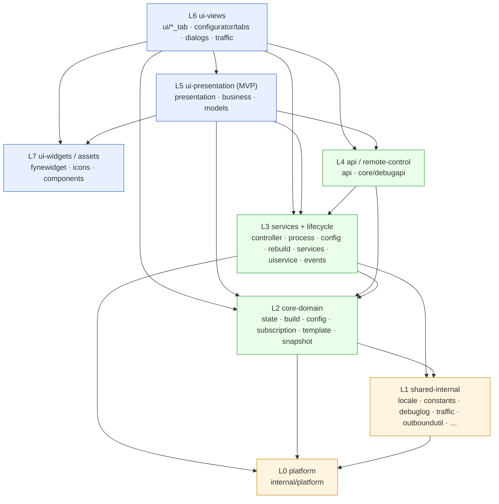

# Архитектура — singbox-launcher

**🌐 Язык**: [English](ARCHITECTURE.md) | Русский

> Статус: модель слоёв и ADR актуальны на SPEC 070 (рефакторинг архитектуры и
> чистка); §11 описывает швы движка ядра и удалённых машин, добавленные SPEC
> 096–099. Ветка `develop`.
> Документ описывает **модель слоёв, правила зависимостей, систему событий,
> модель состояния, потоки данных и build-пайплайн** приложения, а также
> Architecture Decision Records (ADR), которые ими управляют.
>
> Смежные документы:
> - **[ARCHITECTURE_PACKAGES.ru.md](ARCHITECTURE_PACKAGES.ru.md)** — инвентарь по пакетам и файлам (раздел 8), сгруппированный по слоям.
> - **[DATA_FLOW.ru.md](DATA_FLOW.ru.md)** — потоки load / save / build / preset-toggle / edit-dialog (взгляд со стороны хранения).
> - **[WIZARD_STATE.ru.md](WIZARD_STATE.ru.md)** — схема `state.json` v6.
> - **[TEMPLATE_REFERENCE.ru.md](TEMPLATE_REFERENCE.ru.md)** — схема `wizard_template.json`, пресеты, vars, `#if`.
> - **[ParserConfig.ru.md](ParserConfig.ru.md)** — справочник парсера подписок и share-URI.
> - **[API.ru.md](API.ru.md)** — справочник Debug HTTP API.
> - **[DAEMON_AND_REMOTE.ru.md](DAEMON_AND_REMOTE.ru.md)** — daemon-движок ядра, сопряжение, удалённые машины (пользовательский взгляд на §11).

---

## 1. Обзор

`singbox-launcher` — кросс-платформенный (Windows / macOS / Linux) десктопный GUI,
управляющий VPN-ядром sing-box. Написан на Go с [Fyne](https://fyne.io) для UI.
Лаунчер скачивает и пиннит бинарь sing-box — а именно форк
[`sing-box-lx`](https://github.com/Leadaxe/sing-box-lx) (`constants.RequiredCoreVersion`,
актуальный пин — в `internal/constants/constants.go`; собран с build-тегами `with_xhttp` + `with_awg` и взят
из GitHub Releases форка; форк собирает все платформы, включая ассет
`legacy-windows-7` для Windows 7 (`windows/386`), так что XHTTP/AWG работают и
там — отдельного upstream/legacy-разделения больше нет). Он забирает и разбирает
подписки на прокси (VLESS / VMess / Trojan / Shadowsocks / Hysteria2 / TUIC / SSH /
SOCKS / Naive / WireGuard, плюс формат JSON-массива Xray, профили Amnezia `vpn://`
и вставленный текст `[Interface]/[Peer]` из WG/AWG-конфигов) — включая транспорт
**XHTTP** (`type=xhttp` для VLESS/VMess/Trojan: разбирается, генерируется в
`config.json` и round-trip'ится обратно в share-URI) и **AmneziaWG 2.0** на
WireGuard-эндпоинтах (параметры обфускации `jc`/`jmin`/`jmax`, `s1`–`s4`, `h1`–`h4` —
одиночные значения или диапазоны рандомизации `lo-hi`, CPS-пакеты `i1`–`i5`; MTU
AWG-эндпоинта авто-клампится до 1280) — и собирает рабочий `config.json` из
редактируемого пользователем **состояния** плюс версионированного **шаблона**.
Мастер конфигурации («конфигуратор») позволяет править источники подписок,
глобальные outbound'ы, правила маршрутизации и DNS — всё с предпросмотром через
тот же резолвер-пайплайн, что используется в финальной сборке.

Рантайм-сторона запускает и супервизит процесс sing-box (машина состояний
crash/restart, обработка sleep/resume, чистка фантомных WinTun-адаптеров на
Windows), говорит с работающим ядром через Clash API (список прокси,
переключение, тесты задержки), поднимает опциональный входящий Debug HTTP API для
интроспекции и автоматизации и ведёт Traffic Profiler.

Начиная со SPEC 096–099 «работающее ядро» — не обязательно дочерний процесс на
этой машине. Шов `CoreBackend` делает два движка взаимозаменяемыми — *classic*
(спавн `sing-box run`, Clash HTTP) и *daemon* (macOS: ядро живёт внутри
долгоживущей службы `sing-box lxd`, управление по gRPC + admin REST), — а тот же
gRPC-клиент управляет **удалёнными машинами** (роутер, VPS, другой Mac), у каждой
из которых свой профиль визарда, собранный конфиг, деплой, профайлер трафика и
окно телеметрии хоста. См. §11.

Кодовая база организована в слои со строго нисходящими зависимостями (L0–L7);
SPEC 070 кодифицировал эти слои, удалил мёртвый код, дедуплицировал листовые
хелперы и разбил большинство файлов-монолитов — сознательно отложив
высокорисковые декомпозиции жизненного цикла и UI-контроллера, которым нужна
проверка на живом GUI.

---

## 2. Модель слоёв (L0 → L7)

Кодовая база организована в **восемь слоёв**. Кардинальное правило:

> **Импорты идут только вниз.** Пакет слоя L*n* может импортировать пакеты из
> L*n* или любого нижележащего слоя, но никогда — вышележащего. Там, где нижнему
> слою нужно дотянуться «вверх» (например, доменному коду — уведомить UI), это
> делается через **интерфейс** (`UIUpdater`, `ControllerFacade`, `PresetLite`) или
> **колбэк / EventBus**, но никогда конкретным импортом.

| Слой | Название | Пакеты | Ответственность |
|-------|------|----------|----------------|
| **L0** | platform | `internal/platform` | Абстракция ОС за единым интерфейсом: sleep/wake, HWID-информация об устройстве, перечисление процессов, чистка призрачных WinTun-адаптеров, канонические геттеры путей. Зависит только от stdlib + `debuglog`/`constants`. Никаких импортов вверх. |
| **L1** | shared-internal (листовые утилиты) | `internal/locale`, `internal/srstag`, `internal/outboundutil`, `internal/urlsafe`, `internal/debuglog`, `internal/constants`, `internal/traffic`, `internal/textnorm`, `internal/urlredact`, `internal/ctxutil`, `internal/process`, `internal/wizardsync`, `internal/lxdclient` | Самодостаточные, ни от чего не зависящие хелперы, переиспользуемые всеми слоями: каталог i18n, контент-адресуемое хеширование SRS-тегов, маппинг reject/drop outbound → rule (единый источник истины для core и UI), allowlist URL-схем, уровневое логирование, профайлер трафика (развязанный, только stdlib), нормализация отображения тегов, редакция URL и mTLS-клиент демона `sing-box lxd` (пиннинг, разбор приглашений, идентичность на машину — без состояния приложения). |
| **L2** | core-domain (состояние + сборка + конфиг + шаблон) | `core/state`, `core/snapshot`, `core/build`, `core/config`, `core/config/subscription`, `core/config/configtypes`, `core/config/parser`, `core/template` | Чистый домен: схема состояния, загрузка/сохранение/миграции, JSON-пайплайн сборки и чистые резолверы, загрузка/разбор/кодирование подписок и генерация outbound'ов, загрузка шаблона и извлечение пресетов, снятие снапшота. Чистые функции где возможно; **никакого Fyne, никакого `AppController`**. |
| **L3** | сервисы + жизненный цикл | `core/services`, `core/uiservice`, `core/events`, `core` (`controller.go`, `process_service.go`, `config_service.go`, `rebuild.go`, `auto_update.go`, `backend*.go`, `daemon_manager_darwin.go`, `main.go`, загрузчики) | Реализации сервисов с состоянием (`FileService`/`APIService`/`StateService`/`SRSDownloader`, реестр удалённых машин, транспорт, сборщик ресурсов для Deploy), контейнер UI-колбэков (без зависимости от Fyne), типизированный `EventBus`, оркестрация жизненного цикла приложения и процесса и шов движков `CoreBackend` (`LegacyBackend` / `DaemonBackend`). **Владеет EventBus и всей DI-разводкой.** |
| **L4** | api / удалённое управление | `api`, `core/debugapi` | Исходящий клиент Clash API (`api/`) и входящий Debug HTTP API (`core/debugapi`), который интроспектирует и управляет приложением через интерфейс `ControllerFacade`. Оба стоят выше домена, но достижимы из сервисов; `debugapi` говорит с контроллером только через интерфейс. |
| **L5** | ui-presentation (MVP конфигуратора) | `ui/configurator/presentation`, `ui/configurator/business`, `ui/configurator/models`, `ui/configurator/configurator.go`, `ui/configurator/utils` | MVP-слои визарда: **presentation** (оркестрация + диспетчеризация `fyne.Do`), **business** (чистая логика за интерфейсом `UIUpdater` — никогда не импортирует Fyne), **models** (чистая `WizardModel` + контейнеры слотов и порядка). `business → models → core-domain`; `presentation → business`; **business никогда не импортирует presentation**. |
| **L6** | ui-views (вкладки / диалоги / корень) | `ui` (`app.go` + `*_tab.go`), `ui/configurator/tabs`, `ui/configurator/dialogs`, `ui/configurator/outbounds_configurator`, `ui/traffic` | Представления Fyne: корневая полоса вкладок, главные вкладки (Локально / Удалённые, затем Настройки / Диагностика / Справка), вкладки и диалоги конфигуратора, конфигуратор outbound'ов, окно профайлера трафика и окна на машину (добавление машины, настройки подключения, телеметрия хоста, ресурсы, профайлер машины). Подписывается на EventBus / колбэки UIService; читает домен для отрисовки. |
| **L7** | ui-виджеты / ассеты | `internal/fynewidget`, `ui/icons`, `ui/components` | Переиспользуемые самодостаточные строительные блоки Fyne и ассеты: hover-строки, check-with-content, проброс hover, тултипы, скролл-жёлоб, встроенные SVG-иконки. Чистая композиция Fyne, без зависимости от `core` (прежнее исключение `click_redirect.go` устранено — см. §3, V1). |

### Диаграмма зависимостей



Резервный ASCII-вариант (стрелки = разрешённое направление импорта, всегда вниз):

```
L7  ui-виджеты / ассеты ─────────────────────────────────┐ (до них дотягиваются L6/L5)
L6  ui-views ────────────────► L5, L4, L3, L2, L7
L5  ui-presentation (MVP) ────► L4, L3, L2, L7
L4  api / удалённое управление ► L3, L2
L3  сервисы + жизненный цикл ─► L2, L1, L0          (владеет EventBus + DI)
L2  core-domain ──────────────► L1, L0              (чистый; без Fyne и контроллера)
L1  shared-internal ──────────► L0
L0  platform ─────────────────► (только stdlib)
```

> **Обходные пути наверх (по замыслу, не нарушения):**
> - `core/debugapi` (L4) → `AppController` через интерфейс `ControllerFacade`.
> - `ui/configurator/business` (L5) → presentation через интерфейс `UIUpdater`.
> - Интерфейс `PresetLite` из `core/template` живёт в `core/state`, чтобы разорвать цикл.
> - Уведомления L3 → L6/L5 идут через EventBus и колбэки UIService.

---

## 3. Правила слоёв и известные нарушения

Единственное правило (импорты идут вниз; вверх — только через интерфейс или
колбэк) по большей части соблюдается: у `internal/platform`, `internal/traffic`,
`internal/lxdclient` и `api` нет импортов вверх; `business` никогда не импортирует
Fyne; `debugapi` использует фасад. SPEC 070 кодифицировал слои именно для того,
чтобы немногочисленные реальные нарушения стали видимыми и отслеживаемыми;
чистка SPEC 094–099 затем закрыла V1 и V3.

| # | Нарушение | Где | Статус | Задуманное исправление |
|---|-----------|----------|--------|--------------|
| V1 | Виджетный пакет L7 импортирует `singbox-launcher/core`, чтобы добраться до `UIService.WizardWindow` ради подъёма фокуса. | `ui/components/click_redirect.go` → `core` | **Исправлено** (чистка SPEC 094–099, `ce8048e`) | Сделано: `ClickRedirect` теперь принимает `*uiservice.UIService` — листовой пакет — вместо целого `*core.AppController`. `ui/components` больше не импортирует `core` вовсе, и это заодно сократило транзитивные внутренние зависимости `ui/traffic` с 20 до 8, сделав задокументированную изоляцию от `AppController` фактической. |
| V2 | Корневая главная вкладка (L6) тянется вбок и вниз, в пакет конфигуратора и его модели (`ValidateStateID`). | `ui/core_dashboard_tab.go` → `ui/configurator` + `ui/configurator/models` | **Открыто** (намеренный «запуск визарда с дашборда»; слишком широко) | Сузить до точки входа-лаунчера и поднять валидацию ID в `core/state` (состояние валидирует свои ID само). (SPEC 070 P6) |
| V3 | Фоллбэк `GetController()` собирает полусобранный `AppController`, расходящийся с `NewAppController`, создавая два пути конструирования. | `core/controller.go` `GetController()` | **Исправлено** (фоллбэка больше нет) | Сделано: `GetController()` теперь просто возвращает синглтон (nil до конструирования), `NewAppController` в `main()` — единственный путь конструирования, а `GetControllerOrPanic()` закрывает вызовы, которые без него не могут продолжаться. Вторая половина ADR-070-7 — *извлечение полей и блокировок* — остаётся отложенной (§10.2). |
| V4 | Легаси `State.CustomRules`/`DNSOptions` и канонические `State.Rules`/`DNS` держатся как **параллельные источники истины** внутри доменного слоя (нарушение слоистости истины, а не границы пакета). | хелперы load/sync в `core/state` | **Открыто** (отложено; см. ADR-070-2) | Сделать канонические `Rules`/`DNS` единственной хранимой истиной; легаси-представления выводить по требованию в слое UI/business. |
| V5 | `StateChanged` и `ConfigBuilt` публикуются из L3/L5, но у них **ноль подписчиков на EventBus**, тогда как `VpnStateChanged` использует **и** EventBus, **и** легаси-колбэк UIService (`UpdateCoreStatusFunc`) — двойная разводка на границе L3/L6. | `core/services/state_service.go`, `core/rebuild.go`, `presenter_save.go` (издатели); подписчиков нет | **Открыто** (отложено; см. ADR-070-3, SPEC 047 фаза 6) | Подписать `ConfigBuilt`/`StateChanged` в дашборде и вывести из обращения параллельные колбэки. |

> CI-проверка графа импортов, обеспечивающая правило L*n* → L*≤n*, **запланирована**
> (ADR-070-1), но пока не реализована.

---

## 4. Система событий

### 4.1 EventBus (`core/events`)

В лаунчере есть небольшая типизированная **синхронная** шина событий, введённая в SPEC 047.

- **Типизированная.** Каждое событие — `events.Event{Kind EventKind, Payload any}`.
  Тип payload фиксирован для каждого kind (`StateChangedPayload`,
  `ConfigBuiltPayload`, `VpnStateChangedPayload` в `payloads.go`).
- **Синхронная.** `Publish` вызывает `Handler` каждого подписчика **в вызывающей
  горутине**, по порядку. Обработчики обязаны быть дешёвыми и не блокировать
  (никакой сети и I/O).
- **Изолированная от паник.** Паникующий обработчик восстанавливается и не может
  уронить издателя или соседние обработчики.
- **`Subscribe` возвращает замыкание `Cancel`** (идемпотентное) и потокобезопасен;
  карта обработчиков защищена `RWMutex`.
- Конкретная реализация — `MemoryBus` (`memory_bus.go`); единственным экземпляром
  владеет `AppController` (`ac.EventBus`).

```go
// использование
cancel := bus.Subscribe(events.VpnStateChanged, func(ev events.Event) {
    p := ev.Payload.(events.VpnStateChangedPayload)
    // дешёвая отправка обновления UI …
})
defer cancel()

bus.Publish(events.Event{Kind: events.ConfigBuilt, Payload: events.ConfigBuiltPayload{OK: true}})
```

> **Чистка стадии A (SPEC 070, сделано).** Поверхность шины урезана до тех kind'ов,
> у которых есть реальный производитель или потребитель. Удалены: мёртвые
> `EventKind` `SubscriptionUpdated`, `AutoUpdateStatus`, `PowerResume` и подписчик
> `ProxyActiveChanged` (у него не было издателя); плюс неиспользуемый метод
> интерфейса `Bus.SubscribeAll` и его срез «всех» подписчиков в `MemoryBus`.
> `events.go` теперь определяет **ровно три** kind'а.

### 4.2 Живой каталог событий

| Событие | Payload | Издатель(и) | Подписчик(и) | Статус |
|-------|---------|--------------|---------------|--------|
| **VpnStateChanged** | `VpnStateChangedPayload` | `core/controller.go` (на переходе running-флага в `RunningState.Set`) | `core/auto_update.go` (повтор для упавших источников), `ui/app.go` (обновление иконки вкладки через `fyne.Do`) | **Подключено** — но доставляется дважды: ещё и через легаси-колбэк `UpdateCoreStatusFunc`. |
| **ConfigBuilt** | `ConfigBuiltPayload{OK bool}` | `core/rebuild.go` (OK=false при провале проверки; OK=true при успешной записи и валидации) | **нет** | **Мёртвая подписка** — публикуется, но через шину не потребляется. UI статуса конфига пока управляется колбэком `UpdateConfigStatusFunc`. |
| **StateChanged** | `StateChangedPayload` | `core/services/state_service.go` (мутации dirty-маркеров), `ui/configurator/presentation/presenter_save.go` (на Save в конфигураторе) | **нет** | **Мёртвая подписка** — публикуется, но через шину не потребляется. |

### 4.3 Легаси-колбэки UIService (всё ещё в ходу)

Параллельно с шиной `core/uiservice` держит набор полей-колбэков, на которые UI
вешает обработчики. Они старше EventBus и остаются основным механизмом для
нескольких сигналов:

| Колбэк | Роль | Направление миграции |
|----------|------|---------------------|
| `UpdateCoreStatusFunc` | Обновление UI по состоянию VPN (состояния кнопок Start/Stop/Restart) | Параллелен `VpnStateChanged`. Вывести из обращения в пользу подписки на шину. |
| `UpdateConfigStatusFunc` | Метка статуса конфига / гейтинг кнопки Update / dirty-маркеры | Заменить подпиской на `ConfigBuilt` в дашборде ядра. |
| `UpdateParserProgressFunc` / `ShowSubsResultFunc` | Многошаговый прогресс подписок + финальный тост | **Оставить** — многошаговый прогресс; позже может стать типизированным событием прогресса (низкий приоритет). |
| `RefreshAPIFunc` / `ResetAPIStateFunc` / `AutoPingAfterConnectFunc` | Разводка refresh/reset/auto-ping для Clash API | **Оставить** — вне scope чистки событий SPEC 070. |

> **Направление миграции (ADR-070-3).** Цель: `VpnStateChanged`, `ConfigBuilt` и
> `StateChanged` доставляются **исключительно** через EventBus, а
> `UpdateCoreStatusFunc`/`UpdateConfigStatusFunc` удалены. Эта консолидация —
> **SPEC 047 фаза 6 / SPEC 070 P5** — **ещё не сделана**; описанная выше двойная
> разводка и есть текущая реальность. Вызовы публикации `ConfigBuilt`/`StateChanged`
> сохранены (а не удалены) именно для того, чтобы подписчиков можно было подключить
> без перекладки издателей.

---

## 5. Модель состояния

### 5.1 Текущая реальность: canonical-v6 + легаси-проекция (dual-state)

`core/state.State` сейчас несёт **два параллельных представления** одних и тех же данных:

- **Канонические поля v6:** `Connections` (источники / outbound'ы / дефолты),
  `Rules[]` (kind = preset / inline / srs) и `DNS` (плоские `servers[]` / `rules[]`
  с дискриминатором kind). Именно это `Save` пишет на диск (`meta.version = 6`,
  `schema = presets_v1`).
- **Легаси-представление:** `ParserConfig` (прокси), `CustomRules`, `DNSOptions`,
  `SelectableRuleStates`. Они зеркалят канонические данные для UI-путей обратной
  совместимости, которые всё ещё читают легаси-форму.

Два представления синхронизируются **адаптерами**:

- На **Save**: `syncConnectionsFromLegacy` (`sync_to_connections.go`) копирует
  `ParserConfig.Outbounds → Connections.Outbounds` (побеждает «синхронизированная» версия).
- На **Load**: `syncLegacyFromConnections` (`sync_to_legacy.go`) заполняет
  `ParserConfig` из `Connections`; `legacyCustomRulesFromV6` (в `load_v6.go`)
  выводит `CustomRules` из `Rules`.
- Для headless-путей `Load → мутация → Save` (авто-обновление, log-level,
  config_service) `deriveV6FromLegacy` (в `load_v5.go` / `load_v2_v3_v4.go`)
  добивает пустые канонические `Rules`/`DNS` из легаси-представления — это
  **обходной путь «BUG1»**.

**Проблема dual-state.** Поскольку оба представления хранятся и добиваются в
рантайме, headless-пути, мутирующие одно представление без переэмиссии из
конфигуратора, могут разойтись с UI. `deriveV6FromLegacy` и
`legacyCustomRulesFromV6` существуют исключительно чтобы прикрыть наличие двух
источников истины. (Это нарушение слоистости **V4** выше.)

### 5.2 Задуманная цель (ADR-070-2) — пока не реализована

`core/state.State` хранит **только** канонические `Rules`/`DNS`/`Connections`.
Легаси `CustomRules`/`DNSOptions`/`ParserConfig.Proxies` становятся **проекциями
по требованию**, вычисляемыми в слое UI/business (например, хелпером
`wizardmodels`), а не полями `State` и не добиваются в рантайме. Двунаправленный
адаптер выживает **только** как read-time прослойка миграции для старых (v2–v5)
файлов на диске. Как только вкладки Rules/DNS начнут читать канонические поля
напрямую, `deriveV6FromLegacy`, `legacyCustomRulesFromV6` и
`State.CustomRules`/`DNSOptions`/`SelectableRuleStates` можно будет удалить.

> **Точный статус:** dual-state **всё ещё на месте**. *Путь записи* схемы уже
> единственный (только канонический v6, с тех пор как SPEC 060 убрал двойную
> запись); остаётся убрать легаси-поля в памяти и добивание в рантайме. Отложено
> в SPEC 070 P6 (см. §10), потому что требует миграции вкладок Rules/DNS/источников
> и проверки каждого headless-вызова под живым GUI.
>
> **Заметка об откате:** устранение однажды уже было внедрено (коммит `43a5f11`,
> канонический v6 как единственная хранимая истина) и затем **откачено**
> (`a58a176`), после того как GUI-тест round-trip вскрыл регрессию сохранения DNS.
> Подход верный, но повторное внедрение требует контролируемой проверки
> save/load вкладок Rules/DNS/источников на живом GUI — поэтому оно остаётся
> отложенным и задокументированным, а не «в работе».

### 5.3 Миграция схемы на диске

`Load` разбирает любую дисковую форму v2..v6 и нормализует вперёд к каноническому
`State` в памяти; `Save` всегда пишет v6. Определение схемы направляет в парсеры
по версиям (`load_router.go` → `load_v6.go` / `load_v5.go` / `load_v2_v3_v4.go`), за
каждым из которых следует общий `normalizeAfterLoad` (`load_normalize.go`). Полная
схема — в [WIZARD_STATE.ru.md](WIZARD_STATE.ru.md).

---

## 6. Потоки данных

У лаунчера два ведущих потока: **приём** (подписка → узлы → состояние → конфиг) и
**правка в UI** (визард → состояние → пересборка). Оба сходятся на едином писателе
конфига. Взгляд со стороны хранения, с диаграммами, — в
[DATA_FLOW.ru.md](DATA_FLOW.ru.md).

### 6.1 Приём → состояние → сборка → config.json → запуск

Кратко: UI или авто-обновление запускает
`config_service.UpdateConfigFromSubscriptions` → загрузка тела подписки (HTTP GET с
HWID/UA-заголовками, максимум 10 МБ) → декодирование base64 →
`ClassifySubscriptionBody` выбирает одну из трёх ветвей: список URI, JSON-массив
Xray или тело sing-box JSON (SPEC 094). Затем префикс/постфикс/маска тегов,
skip-фильтр и дедупликация → `[]ParsedNode`.

Импортированные `selector`/`urltest` становятся **узлами** схемы `group`
(`configtypes.SchemeGroup`) в том же списке, что и обычные узлы. Привилегий у них
нет: они не попадают во вкладку Направлений визарда, правила маршрутизации на них не
ссылаются, состав не редактируется пользователем — эта вкладка остаётся за
собственными **каналами** лаунчера, которые и управляют маршрутизацией.

Внутри одного источника узлы дедуплицируются по идентичности (SPEC 094 D3)
**до** назначения тегов, иначе `MakeTagUnique` выдал бы дубликату тег с `…-2`
первым. Идентичность — `config.NodeIdentityHash`: sha256 по эмитированному JSON
outbound'а с удалёнными `tag` и `detour` и отсортированными ключами. Эмиттер живёт
в `config`, а парсер — в `subscription`, поэтому зависимость инжектится сверху вниз
через `subscription.NodeIdentityHashFunc` (разводка в `core/controller.go`): прямой
вызов замкнул бы цикл импортов.

Дальше: запись raw-тела источника атомарно, генерация JSON outbound'ов в кеш,
мутация состояния и `state.Save`, затем **сборка** — `rebuild.RebuildConfigIfDirty`
(единственный писатель `config.json`) собирает `BuildContext` и вызывает чистую
`build.BuildConfig`, после чего конфиг атомарно пишется на диск. При запуске
(`ProcessService.Start`) сначала отрабатывает пред-стартовый хук пересборки, потом
поднимается sing-box с горутиной `Monitor`, публикуется `VpnStateChanged`.

### 6.2 Правка в UI → состояние → пересборка

Пользователь правит `WizardModel` (Sources / GlobalOutbounds / Rules / DNS) во
вкладках конфигуратора → на Save презентер синхронизирует GUI → модель
(`ReconcileRuleOrder`, `SyncRulesByOrderToStateRulesV6`, `SyncDNSByOrderToState`) →
`presenter_save` валидирует → `state.Save` (v6) → публикация `StateChanged` и
авто-`RebuildConfigIfDirty` → диалог успеха. Следующий Start переприменяет всё
через пред-стартовый хук пересборки.

### 6.2.1 config.json → детали узла в UI (SPEC 095)

Список серверов питается `api.ProxyInfo` из Clash API, который несёт только `Name`,
`ClashType`, `Delay` и `Traffic` — ни транспорта, ни TLS, ни принадлежности к
группе. Поэтому всё, что UI показывает сверх тега и задержки, приходит из
сгенерированного `config.json`, прочитанного обратно через
`ui/configurator/business.LoadConfigNodes` → `ConfigNodes.Lookup(tag)`.

Это обратное чтение питает подзаголовок строки (`vless·tcp·Reality+Vision`), значок
режима группы (`⚖️ [37]` для `mode: round_robin`, иначе `🎯 [11]`) и окно Info. Тег,
отсутствующий в конфиге, — не ошибка: Clash API может сообщить об узле из конфига,
который с тех пор пересобрали, и UI просто опускает деталь.

Вкладке Preview у источника те же детали нужны **до** того, как конфиг вообще
появится: подписка только что разобрана и ещё не сохранена. Поэтому она читает
напрямую из `ParsedNode` через параллельную пару файлов
(`ui/configurator/tabs/preview_node_subtitle.go`, `preview_node_info.go`).

### 6.3 Инвариант единственного писателя (ADR-070-4)

> **У `config.json` ровно один писатель: `rebuild.RebuildConfigIfDirty`.**
> Проверено в коде: `RebuildConfigIfDirty` — единственная функция, вызывающая
> `atomicWriteConfig(ac.FileService.ConfigPath, …)`. `Start()` пересобирает перед
> запуском sing-box (пред-стартовый хук); `Update()` авто-пересобирает при успешном
> обновлении кеша; `RebuildConfigIfDirty` пропускает работу, когда всё чисто и
> пересборка не форсирована. Ни `Start`, ни `Update` не пишут `config.json` напрямую.
> Инвариант предотвращает регрессии «старый конфиг на старте» и является якорем
> машины состояний Start/Build/Save.

---

## 7. Build-пайплайн конфига

Пайплайн сборки — **чистый резолвер-пайплайн** (ADR-070-5): нечистые заботы
(сетевые запросы, I/O состояния, сигналы в UI) живут в `config_service`/`services`,
а собственно сборка JSON — чистая функция над явным `BuildContext`.

```
state.json (+ raw-кеш на источник)  +  wizard_template.json
            │
            ▼
config_service.buildContextFromState
            │   собирает BuildContext{Template, Vars, Cache, DNS, Route, Preset}
            ▼
build.BuildConfig  (чистая)
            │
            ├─► sanitizeOutboundGraph  (финальный проход по графу зависимостей)
            │      один обход ВСЕХ видов рёбер (member группы / detour / позиция
            │      цепочки): висячие ссылки, кольца через рёбра разных видов,
            │      инварианты цепочек («вложенная цепочка только позицией 0») —
            │      деградировать один элемент с warning, а не отдать ядру конфиг,
            │      который оно отвергнет целиком
            │
            ├─► BuildOutboundsSection / BuildEndpointsSection
            │      (потребляют BuildContext.Cache = вывод GenerateOutboundsFromParserConfig)
            │
            ├─► MergeDNSSection → MergePresetsIntoDNS → ResolveDNS (чистая)
            │      обход state.DNS по kind (template / preset / user),
            │      навешивание метаданных (Source / Required / Locked / Active / Enabled)
            │
            └─► MergeRouteSection → MergePresetsIntoRoute → ResolveRoute (чистая)
                   обход state.Rules по kind (preset / inline / srs),
                   ExpandPreset на каждую preset-ссылку (подстановка @vars, вычисление
                   if/if_or, префиксы тегов, чистка висячих ссылок rule_set)
            │
            ▼
конкатенация финального JSON → atomicWriteConfig(config.json)
```

Ключевые свойства:

- **`BuildContext` — это шов.** Всё, что нужно `BuildConfig`, захвачено в структуре
  контекста; сама функция не делает I/O. Инвариант `Preset.ExecDir` (устанавливается
  сборщиком контекста) необходим для разрешения локальных путей SRS.
- **Одно разрешённое представление для UI и сборки.** `ResolveDNS` / `ResolveRoute`
  (и резолвер outbound'ов по записи) — единственный источник истины, потребляемый
  **и** предпросмотром визарда, **и** финальной эмиссией, поэтому предпросмотр
  никогда не расходится с записанным конфигом.
- **`ExpandPreset` единственный в своём роде.** И `ResolveRoute`, и `ResolveDNS`
  вызывают его один раз и потребляют результат; `evalIf` и фильтрация по if живут в
  одном месте (`preset_expand.go`).
- **Генерация JSON outbound'ов** вынесена из монолита в `outbound_validity.go`
  (трёхпроходный алгоритм), `outbound_jsonbuilder.go` (`JSONBuilder`, добавляющий
  поля в порядке вставки вместо хрупкой связки `fmt.Sprintf` + `strings.Join`) и
  `outbound_filter.go`. `JSONBuilder` внедрён **частично** — полный перевод всех
  генераторов протоколов на него отложен (см. §10).

---

## 8. Инвентарь по пакетам

Полный инвентарь по пакетам и файлам (одна строка ответственности на пакет,
ключевые файлы с однострочным назначением), сгруппированный по слоям L0–L7, вынесен
в отдельный файл, чтобы этот документ оставался читаемым:

➡ **[ARCHITECTURE_PACKAGES.ru.md](ARCHITECTURE_PACKAGES.ru.md)**

---

## 9. Architecture Decision Records (ADR)

Семь ADR, принятых SPEC 070. Легенда статусов: **Реализовано** · **Частично
реализовано** · **Запланировано (отложено)**. Полные формулировки решений и
обоснований — в английской версии, [ARCHITECTURE.md §9](ARCHITECTURE.md).

| ADR | Суть | Статус |
|---|---|---|
| **ADR-070-1** | Семислойная модель пакетов со строго нисходящими зависимостями; доступ снизу вверх — через интерфейсы или колбэки; CI-проверка графа импортов. | **Частично реализовано.** Слои задокументированы и в основном соблюдаются; CI-проверка **запланирована**; нарушение V2 остаётся открытым. |
| **ADR-070-2** | Каноническое состояние v6 — единственный источник истины; легаси-представления вычисляются по требованию. | **Запланировано (отложено).** Путь записи уже единственно-канонический (v6), но легаси-поля в памяти и добивание никуда не делись (SPEC 070 P6). |
| **ADR-070-3** | Типизированный EventBus — единственный механизм межслойных уведомлений об изменении состояния. | **Частично реализовано.** Мёртвые kind'ы и `SubscribeAll` удалены; `VpnStateChanged` на шине, но всё ещё разведён дважды; `ConfigBuilt`/`StateChanged` публикуются без подписчиков. |
| **ADR-070-4** | У `config.json` ровно один писатель (`rebuild.RebuildConfigIfDirty`). | **Реализовано.** Проверено: `atomicWriteConfig(ConfigPath, …)` вызывается только из `RebuildConfigIfDirty`. |
| **ADR-070-5** | Чистый резолвер-пайплайн (state → BuildContext → BuildConfig). | **Частично реализовано.** Пайплайн чист и покрыт golden-тестами; `JSONBuilder` существует и используется, но полный перевод генераторов протоколов отложен. |
| **ADR-070-6** | Двунаправленная логика протоколов единственна в своём роде — через spec-билдеры. | **Частично реализовано.** Разбиение по протоколам и общие утилиты сделаны; объединённые билдеры `TransportSpec`/`TLSSpec` **отложены**. |
| **ADR-070-7** | Единственный путь конструирования `AppController` плюс сфокусированные суб-менеджеры. | **Частично реализовано.** Единственный путь конструирования **сделан** (фоллбэк `GetController` удалён); извлечение полей и блокировок — **нет** (высокий риск гонок; SPEC 070 P5). |

---

## 10. Дорожная карта рефакторинга (SPEC 070)

### 10.1 Что сделано

SPEC 070 выполнялся последовательностью стадий, каждая — с сохранением поведения и
(где применимо) под golden-тестами: чистка событий (стадия A), дедупликация
листовых и протокольных хелперов (B/C), разбиение доменных монолитов (D:
`core/state/load.go`, `adapter.go`, `node_parser.go`, `share_uri_encode.go`,
`api/clash.go`, чистка WinTun), декомпозиция build-пайплайна (E) и разбиение
presentation/business (F). Подробный список файлов — в английской версии, §10.1.

### 10.2 Что осталось (задумано, но отложено)

Эти цели **описаны ADR, но намеренно не реализованы в SPEC 070**. Общая причина:
они затрагивают живой GUI-рантайм и/или высококонкурентный жизненный цикл, поэтому
требуют интерактивной проверки, которой механические разбиения выше не требовали.

| Цель | ADR | Почему отложено |
|--------|-----|--------------|
| **Извлечение полей и блокировок контроллера** — разбить `controller.go` на `ProcessLifecycleManager` + `CacheManager` + тонкий `AppController`; объединить `Monitor` и `onPrivilegedScriptExited` в один `CrashHandler`. (Вторая половина ADR — удаление фоллбэка `GetController` — **сделана**.) | ADR-070-7 | **Высокий риск гонок.** Перераспределение четырёх независимых мьютексов при одновременных Update+Start может внести дедлоки и гонки, которые юнит-тесты не поймают. |
| **Устранение dual-state** — сделать канонические `Rules`/`DNS`/`Connections` единственной хранимой истиной; удалить `deriveV6FromLegacy`, `legacyCustomRulesFromV6` и легаси-поля. | ADR-070-2 | **Нужна проверка на живом GUI.** Каждый headless-вызов `Load → мутация → Save` и каждая вкладка, читающая легаси-представление, должны быть перенесены и перепроверены на реальных файлах состояния. |
| **Полный переход с колбэков на события** — подписать `ConfigBuilt`/`StateChanged` в дашборде; вывести из обращения `UpdateCoreStatusFunc`/`UpdateConfigStatusFunc`. | ADR-070-3 | **Нужна проверка на живом GUI.** Обновление статуса в UI чувствительно к таймингам (`fyne.Do`, стилизация dirty-маркеров); смену механизма доставки надо наблюдать вживую. |
| **Полное внедрение `JSONBuilder`** — перевести все генераторы полей протоколов в `GenerateNodeJSON` и генерацию селекторов на `JSONBuilder`, под golden-тестами. | ADR-070-5 | **Частично сделано.** Билдер существует и используется; завершение — инкрементальная работа, не блокирующая. |
| **Объединение транспорта и TLS** — слить `uriTransportFromQuery` и `xrayTransportFromStreamSettings` в один билдер `TransportSpec`, а три TLS-билдера — в один `TLSSpec`. | ADR-070-6 | **Риск изменения поведения на round-trip.** Оба пути сегодня эмитят слегка разные формы sing-box; объединение требует golden round-trip тестов по всем протоколам. |
| **Декомпозиция UI-представлений** — `clash_api_tab.go` (1701 строка, крупнейший даже после вынесения `_helpers`/`_render`/`_autorefresh`), `add_rule_dialog.go` (1154), `outbounds_configurator/edit_dialog.go` (1095). | (поддерживает ADR-070-1) | **Нужна проверка на живом GUI и очередь после dual-state.** Эти замыкания захватывают много изменяемого состояния UI. |
| **Декомпозиция `config_service.go`** — разбиение файла **сделано** (1066 → ~538 строк); осталось поднять отпочковавшиеся файлы до настоящих швов `SubscriptionFetcher` / `ConfigContextBuilder` и разделить `UpdateConfigFromSubscriptions`. | (поддерживает ADR-070-5) | **Высокий риск гонок.** Нужно сохранить границы `SubscriptionMu` через новые швы сервисов. |
| **CI-проверка графа импортов**, обеспечивающая L*n* → L*≤n*. | ADR-070-1 | **Запланированный инструмент**, ещё не собран. |

> **Итог:** SPEC 070 завершил *механическую работу с сохранением поведения*
> (чистка событий и мёртвого кода, дедупликация, разбиение монолитов в домене, api,
> platform и subscription, а также менее рискованных файлов UI/business) и
> *задокументировал* модель слоёв и ADR. *Поведенческие* изменения (устранение
> dual-state, переход с колбэков на события) и *высококонкурентные* декомпозиции
> жизненного цикла (`AppController`, `config_service`) отложены в последующие фазы
> (P5/P6), требующие проверки на живом GUI.

---

## 11. Швы движка ядра и удалённых машин (SPEC 096–099)

Пользовательский взгляд на этот раздел — команды установки, сопряжение, раскладка
на диске — живёт в **[DAEMON_AND_REMOTE.ru.md](DAEMON_AND_REMOTE.ru.md)**. Здесь —
сами швы и почему они устроены именно так.

### 11.1 `CoreBackend` — шов движка

> **Ничто выше шва не знает, какой движок работает.** UI, трей, горячие клавиши и
> Debug API добираются до ядра только через активный `CoreBackend`; ни
> `ProcessService`, ни Clash-клиент больше не вызываются из этих слоёв напрямую.

| Реализация | Движок | Управляющая плоскость | Платформы |
|---|---|---|---|
| `LegacyBackend` | classic — спавн и супервизия `sing-box run` | Clash HTTP API | все |
| `DaemonBackend` | daemon — ядро внутри системной службы `sing-box lxd` | gRPC (`daemon.StartedService`) + admin REST | только macOS |

Classic остаётся дефолтом и не меняется. Весь daemon/gRPC-код сидит под darwin
build-тегами и никогда не попадает в `go.win7.mod` — сборка под Win7 компилируется
без grpc/protobuf. Protobuf-стабы демона вендорятся из форка через
`scripts/sync_daemonpb.sh`.

### 11.2 `ProxyTransport` — шов операций с прокси

Операции с группами прокси (список групп, выбор узла, тест задержки, пул
балансировщика) идут через отдельный шов `ProxyTransport`: Clash HTTP для classic,
gRPC для демона или выбранной удалённой машины. Именно поэтому список серверов —
один виджет с одним поведением на обеих вкладках, Локально и Удалённые.

**Область, а не режим.** Транспорт резолвится по *области* (эта машина против
выбранной удалённой), а не по глобальному флагу «режим бэкенда». Именно глобальный
override уводил вкладку Local на пустой baseURL (исправлено в `fe575b6`): резолверы
обязаны спрашивать транспорт своей области, а гейт gRPC — смотреть на
remote-override, а не на режим бэкенда.

### 11.3 Таргет и роль — независимые оси (SPEC 097)

Генерация конфига раньше неявно предполагала «машину, на которой запущен лаунчер»:
`runtime.GOOS` был зашит в пайплайн, а локальные допущения (`clash_api`,
`find_process`, `set_system_proxy`) сидели в шаблоне литералами.

| Ось | Значения | Что определяет |
|---|---|---|
| **таргет** | `local` \| `remote` | где машина: какой файл состояния, какой канал управления, куда идёт результат |
| **роль** | `gateway_mode` (bool) | форвардит ли машина чужой трафик |
| **платформа** | GOOS / GOARCH | для remote задаётся явно; подменяет `runtime.GOOS` во всей генерации |

Роль **не** выводится из таргета: local-gateway легален (Mac + Internet Sharing), а
remote-сервер обычно не gateway. Таргет живёт в `state.meta.target` и доезжает до
шаблона как `@runtime.target`; платформа живёт в записи реестра машины, поэтому
список, визард и `TargetSpec` не могут разойтись.

### 11.4 Профиль на машину (SPEC 098)

У каждой машины своя директория — `bin/wizard_states/remote/<machine-id>/` — с её
`state.json`, собранным `config.json`, `srs/` и `subscriptions/`. До этого единый
общий профиль означал, что настройка второй машины молча затирала первую. Миграция
автоматическая, если сопряжена ровно одна машина; если их несколько, легаси-файлы
остаются нетронутыми с предупреждением в логе, потому что владельца определить
невозможно.

Выбор машины и выбор «для кого собираем» — **один и тот же** выбор: «Настроить» в
строке машины делает визард корневым на её профиле, а Deploy в той же строке
отправляет её собственный конфиг. Промах невозможен по конструкции, а не ловится
проверкой.

### 11.5 Наблюдаемость на машину (SPEC 099)

Локальный `TrafficProfiler` — синглтон (`GetInstance`); профайлер машины — **
отдельный экземпляр** со своим окном, стримами и кольцевым буфером. Один общий
профайлер воспроизвёл бы ту болезнь, которую SPEC 098 вылечил в списке узлов:
открыл профайлер роутера — потерял локальный, а две машины нельзя было бы смотреть
рядом. Экземпляры гаснут вместе со своим каналом (при Disconnect и при удалении
машины).

Источники — только gRPC: у конфига машины нет Clash API by design, а её
`sing-box.log` лежит на её собственной файловой системе. Разбивки по процессам для
машины нет: `find_process` в конфиге роутера выключен, потому что трафик идёт от
устройств сети, а не от процессов этого компьютера, поэтому ось процессов заменена
осью клиентов. Телеметрия хоста (CPU / память / хранилище / сеть самой машины) —
отдельное окно поверх admin REST: профайлер описывает *ядро*, телеметрия описывает
*машину*.
